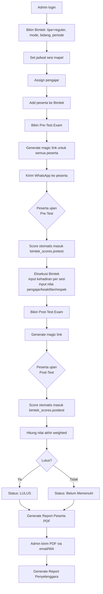
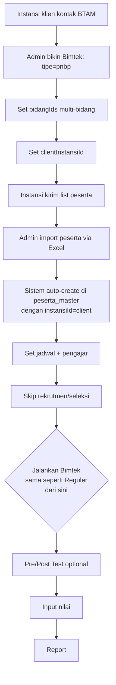
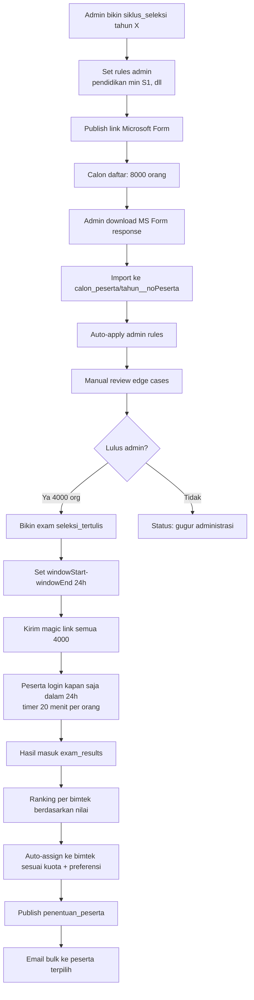
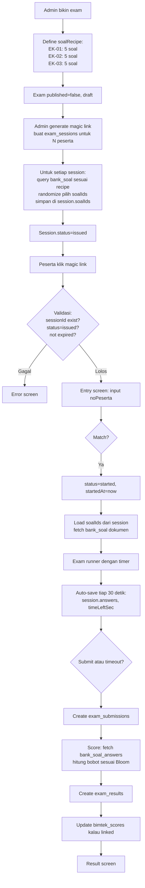
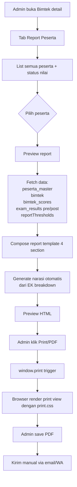
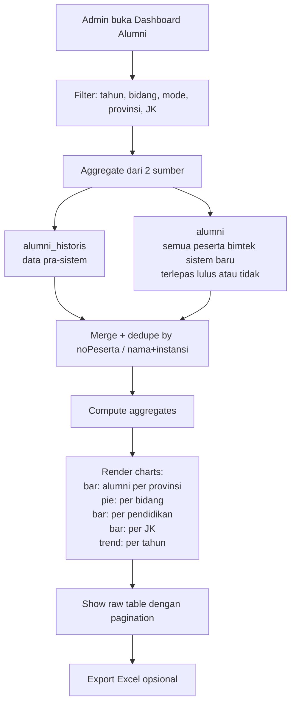
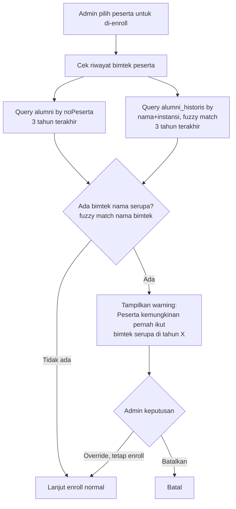

# OPUSPLAN — Blueprint Sistem BTAM Terpadu

**Tanggal:** 20 April 2026 (revisi: mapel 1-9 JP, ISHOMA Jumat 13:45, enum Bimtek diperluas, kinerja instansi, kode_daerah fixed, alumni terpadu + aturan 3 tahun)  
**Status:** Final — siap jadi basis eksekusi  
**Pengganti:** `STATUS_DISKUSI.md` (konsolidasi semua keputusan)  
**Pelengkap:** `SCHEMA_HARMONIZATION.md`, `STRUKTUR_APLIKASI_v3.md`, `kode_daerah_fixed.xlsx`, `data_kinerja_1.xlsx`, `data_all.xlsx`

---

### 📌 Revisi 26 Mei 2026 — Master Elemen Kompetensi (EK)

Tambahan fitur **Master EK Global** + **Tracing Kompetensi Peserta** berdasarkan diskusi `RESUME_DISKUSI_26MEI2026_EK_MASTER.md`.

**Perubahan schema:**
- Collection baru `elemen_kompetensi` (section 4.20)
- Field baru `ekIds: string[]` di `bimtek` (section 4.9)

**Milestone baru (Phase 1):**
- M1.11 — Master EK + Link ke Bimtek + Update Laporan (~8-12 jam)
- M1.12 — Tracing Kompetensi Peserta + Halaman Detail Peserta (~6-10 jam)
- M1.10 (E2E Testing) dipindah ke setelah M1.11–M1.12

**Total Phase 1 direvisi:** ~179-242 jam (naik dari 165-220 jam)

Dokumen ini adalah **blueprint definitif** untuk membangun sistem BTAM terpadu menggantikan 3 aplikasi HTML standalone yang ada (`exam-app-main-11.html`, `penilaian-bimtek-btam.html`, `simlatbang-ai.html`). Dokumen ini mencakup seluruh keputusan arsitektur, schema database, struktur folder, milestone breakdown, dan risk register yang diperlukan untuk memulai coding.

---

### 📌 Revisi 21 Jul 2026 — Perbaikan Penilaian Ujian & Kadaluarsa Sesi + Fitur WhatsApp Massal

Sistem sudah berjalan pasca-Phase 1 (production, dipakai untuk bimtek riil). Perubahan berikut adalah bugfix + fitur tambahan berbasis kebutuhan operasional nyata, di luar scope milestone asli:

**Bugfix — sinkronisasi nilai ujian setelah reset (`admin/js/modules/bimtek/scorer.js`):**
- Root cause: peserta yang di-reset lalu mengerjakan ulang punya >1 dokumen di `exam_submissions` (reset sengaja tidak menghapus submission lama, untuk arsip), tapi `scoreSubmission()`/`scoreAllSubmissions()` mengambil submission secara sembarang (bukan berdasar `submittedAt` terbaru), sehingga nilai attempt lama bisa menimpa nilai attempt baru.
- Fix: kedua fungsi sekarang selalu memilih submission dengan `submittedAt` paling akhir per (noPeserta, tipeSession) sebelum dihitung.

**Bugfix — kadaluarsa sesi pretest = posttest (`admin/js/modules/bimtek/exam-api.js`, `tab-ujian.js`):**
- Root cause: `generateSessions()` menghitung `expiredAt` sekali (default now+72 jam) di luar loop tipeSession, sehingga pretest dan posttest yang digenerate bersamaan (`exam.tipe === 'pretest_posttest'`) selalu dapat timestamp identik — tidak mengacu ke periode bimtek sama sekali.
- Fix: `generateSessions()` sekarang menerima `expiredAt` per tipeSession (object `{pretest, posttest}`). Modal generate sesi di tab Ujian punya input tanggal terpisah untuk Pre-Test dan Post-Test, default mengikuti `periode.mulai`/`periode.selesai` bimtek.
- Tambahan: fungsi `fixSessionsExpiry()` + tombol **"Perbaiki Kadaluarsa"** di tab Ujian untuk menimpa `expiredAt` sesi LAMA yang sudah terlanjur salah (tersedia di semua status bimtek, termasuk `ongoing`, bukan hanya draft/planned — supaya bisa dipakai memperbaiki post test yang sudah expired padahal bimtek masih berjalan).

**Fitur baru — Kirim WhatsApp Massal ke peserta (`admin/js/modules/bimtek/detail.js`, tab Peserta):**
- Checkbox pilih peserta (per-baris + pilih semua) di tab Peserta pada halaman detail bimtek.
- Tombol "Kirim WA Terpilih" membuka modal dengan template pesan yang bisa diedit, dua preset siap pakai: ajakan gabung grup WhatsApp, dan info nomor peserta + kode ujian (placeholder `{nama}`, `{noPeserta}`, `{kodeUjian}`, `{namaBimtek}`).
- Generate menghasilkan link `https://wa.me/62...` per peserta (nomor HP dari `peserta_master.noHp`, dinormalisasi `08xxx`/`8xxx` → `62xxx`), dibuka satu per satu secara manual — **tidak ada integrasi WhatsApp Business API/pihak ketiga** (belum ada di codebase, keputusan: tetap pakai wa.me gratis, bukan Fonnte/Wablas berbayar).

---

## Daftar Isi

1. [Ringkasan Eksekutif](#1-ringkasan-eksekutif)
2. [Arsitektur Sistem](#2-arsitektur-sistem)
3. [Struktur Folder](#3-struktur-folder)
4. [Schema Firestore Lengkap](#4-schema-firestore-lengkap)
5. [Firestore Security Rules](#5-firestore-security-rules)
6. [Alur Workflow Utama](#6-alur-workflow-utama)
7. [Breakdown Phasing & Milestone](#7-breakdown-phasing--milestone)
8. [Bank Soal & Sistem Ujian](#8-bank-soal--sistem-ujian)
9. [Dashboard Alumni](#9-dashboard-alumni)
10. [Risk Register](#10-risk-register)
11. [Testing Strategy](#11-testing-strategy)
12. [Definisi Selesai per Milestone](#12-definisi-selesai-per-milestone)
13. [Appendix — Konvensi Kode](#13-appendix--konvensi-kode)

---

## 1. Ringkasan Eksekutif

### 1.1. Tujuan Sistem

Membangun **satu ekosistem terpadu** untuk seluruh workflow BTAM (Balai Teknik Air Minum), dari rekrutmen peserta sampai monitoring pasca-Bimtek, menggantikan 3 aplikasi terpisah yang saat ini dipakai.

### 1.2. Keputusan Utama

| Keputusan | Pilihan |
|---|---|
| Pendekatan phasing | Opsi α: Core First dengan urutan **1 → 2a → 2b → 3** |
| Peserta master | Opsi C: Hybrid (master + inline-add dari Bimtek) |
| Frontend | Vanilla HTML/JS/CSS + ES Modules + Tailwind CDN |
| Database | Firestore (Firebase project baru) |
| Autentikasi admin | Firebase Auth Email/Password |
| Autentikasi peserta | Magic link (1x pakai dengan window 24 jam) |
| Hosting | GitHub Pages (2 folder: `/admin/` + `/exam/`) |
| Bank soal | Mandiri, kategorisasi Taksonomi Bloom (C1-C6), bobot global setting |
| Strategi exam | Ambil N soal per EK, randomize per session |
| Report format | `window.print()` + print.css, upgrade ke html2pdf.js saat batch |

### 1.3. Struktur Phase Final

```
Phase 1 — Core Bimtek            (Mei-Jul 2026, 168-225 jam)
Phase 2a — Dashboard Alumni      (Aug-Sep 2026, 54-80 jam)
Phase 2b — Rekrutmen Peserta     (Okt-Nov 2026, 55-75 jam)
Phase 3 — Fitur Tambahan         (Des 2026, 41-62 jam + opsional M3.8 15-25 jam)
Final testing & dry run          (Jan 2027, 15-25 jam)
Seleksi 2027 live                (Feb 2027) ✓
```

**Total effort:** 333-467 jam (core); 348-492 jam kalau M3.8 drag-drop scheduler dibangun. Dengan bantuan Claude effort real ~60-70%.

*Catatan revisi 19 Apr 2026:*
- *Phase 1 naik 3-5 jam karena M1.4 scheduler form-based + tab mapel baru.*
- *Phase 3 naik dari 25-40 jam ke 41-62 jam karena M3.6 evaluasi pengajar (10-14j) dan M3.7 analisis soal seleksi tertulis (6-10j).*
- *M3.8 drag-drop scheduler opsional — dibangun hanya jika admin merasa form-based tidak cukup setelah dipakai beberapa bulan.*

*Catatan revisi 20 Apr 2026:*
- *Phase 2a naik dari 35-53 ke 54-80 jam:*
  - *M2a.0 expand ke 8-12 jam (seed instansi_master + kinerja 2019-2023 dari data_kinerja_1.xlsx)*
  - *M2a.1 expand ke 15-22 jam (cleaning engine untuk data_all.xlsx 12k records dengan data messy)*
  - *M2a.2 naik ke 10-14 jam (tambah chart tipe Bimtek)*
  - *M2a.5 BARU — Dashboard Kinerja Instansi (10-15 jam) untuk analisis korelasi Bimtek ↔ kinerja PDAM*

### 1.4. Entitas Utama yang Dimodelkan

4 Bidang BTAM (fixed seed): Produksi, Trandis, ME, Pendukung.

2 Tipe Bimtek:
- **Reguler** — per bidang, wajib seleksi, mode online/offline
- **PNBP** — lintas bidang, peserta ditentukan klien, tanpa seleksi

2 Mode Bimtek:
- **Online** — max 25 peserta/kelas, lokasi Zoom
- **Offline** — max 17 peserta/kelas, lokasi BTAM

---

## 2. Arsitektur Sistem

### 2.1. Dua Aplikasi Terpisah, Satu Database

```
┌──────────────────────────────┐    ┌──────────────────────────────┐
│  ADMIN APP                   │    │  USER APP (Exam Runner)      │
│  /admin/                     │    │  /exam/                      │
│  Dark theme                  │    │  Light theme                 │
├──────────────────────────────┤    ├──────────────────────────────┤
│ Login: Firebase Auth         │    │ Login: Magic link            │
│ (email + password)           │    │ (1x pakai, 24h window)       │
│                              │    │                              │
│ Modul utama:                 │    │ Modul utama:                 │
│ - Master Data                │    │ - Entry screen (noPeserta)   │
│ - Bimtek Management          │    │ - Exam runner + timer        │
│ - Bank Soal                  │    │ - Result screen              │
│ - Ujian Config               │    │                              │
│ - Input Nilai                │    │ Anti-cheat:                  │
│ - Report Generation          │    │ - Fullscreen, tab, copy      │
│ - Dashboard                  │    │ - Rightclick, devtools       │
│ - Settings                   │    │ - Screenshot block, shuffle  │
└──────────────────────────────┘    └──────────────────────────────┘
            │                                   │
            └───────────────┬───────────────────┘
                            ▼
            ┌──────────────────────────────┐
            │  FIRESTORE (shared)          │
            │  Firebase Project baru       │
            │  + Firebase Auth             │
            │  + Firebase Storage          │
            │    (untuk KTP Phase 2b,      │
            │     logo Phase 1)            │
            └──────────────────────────────┘
```

### 2.2. Alasan Dua Aplikasi Terpisah

| Alasan | Penjelasan |
|---|---|
| **Security** | Peserta tidak pernah akses admin UI. Serangan di exam app tidak bocor ke admin data. |
| **Performance** | Exam app hanya load modul yang dibutuhkan untuk ujian (ringan). Admin app load semua (berat). |
| **Deployment independen** | Update admin tidak ganggu peserta yang sedang ujian. |
| **Auth terpisah** | Admin pakai Firebase Auth, peserta pakai magic link — tidak perlu ribet di satu app. |
| **Theme berbeda** | Dark (admin profesional) vs Light (peserta nyaman). |

### 2.3. Tech Stack Lengkap

| Lapisan | Pilihan | Alasan |
|---|---|---|
| Frontend framework | Vanilla JS + ES Modules | No build step, simple, modular |
| Styling | Tailwind CDN | Utility-first tanpa kompilasi |
| Routing | Hash-based SPA router (custom, ~100 baris) | Simple, no dependency |
| State management | Pub-sub store custom (~150 baris) | Cukup untuk scale kita |
| Database | Firestore | Real-time, cloud-synced, Firebase-native |
| Auth admin | Firebase Auth | Standard, secure, built-in reset |
| Auth peserta | Magic link custom (pakai Firestore collection) | Frictionless, controllable |
| File storage | Firebase Storage | Untuk logo + upload KTP di Phase 2b |
| Excel | SheetJS (CDN) | Proven dari aplikasi existing |
| PDF | `window.print()` + print.css | Browser-native Phase 1, upgrade html2pdf.js Phase 3 |
| Charts | Chart.js (CDN) | Untuk report & dashboard |
| AI (Phase 3) | Gemini API | Untuk mode AI outreach pengajar |
| Hosting | GitHub Pages | Gratis, 2 folder: `/admin/`, `/exam/` |
| Domain | TBD (custom domain atau `*.github.io`) | Keputusan deploy |

### 2.4. Model Kolaborasi

- **Claude**: generate kode per-modul (file lengkap), debug, iterasi
- **Anda**: copy ke repo, test di browser, deploy, report hasilnya
- **Batas Claude**: tidak bisa run kode Anda, tidak bisa akses Firebase console Anda, tidak bisa commit ke repo Anda

Setiap milestone idealnya dikerjakan dalam 1 chat session supaya konteks Claude tetap fresh. Dokumen OPUSPLAN ini jadi "context starter" untuk setiap chat baru.

---

## 3. Struktur Folder

### 3.1. Repository Root

```
btam-system/
├── README.md                        ← Cara deploy + develop
├── OPUSPLAN.md                      ← Dokumen ini
├── SCHEMA_HARMONIZATION.md          ← Referensi legacy
├── STRUKTUR_APLIKASI_v3.md          ← Referensi report design
├── .gitignore
├── firebase.json                    ← Config Firebase (emulator, rules)
├── firestore.rules                  ← Security rules
├── firestore.indexes.json           ← Composite indexes
├── storage.rules                    ← Storage security rules
│
├── shared/                          ← Kode yang di-share 2 app
│   ├── firebase-config.js           ← Firebase SDK init
│   ├── auth.js                      ← Auth helpers
│   ├── db.js                        ← Firestore helpers
│   ├── storage.js                   ← Storage helpers
│   ├── normalize.js                 ← normalizePeserta, normalizeNoPeserta
│   ├── validate.js                  ← validatePeserta, validateSoal, etc.
│   ├── constants.js                 ← BIDANG_LIST, BLOOM_LEVELS, etc.
│   ├── date-utils.js                ← Format tanggal, parse periode
│   ├── excel.js                     ← SheetJS wrappers
│   └── logger.js                    ← Audit log helper
│
├── admin/                           ← Admin app (dark theme)
│   ├── index.html                   ← Entry point
│   ├── styles/
│   │   ├── main.css                 ← Custom CSS
│   │   └── print.css                ← Print styling untuk report
│   ├── js/
│   │   ├── main.js                  ← Bootstrap + router
│   │   ├── router.js                ← Hash-based router
│   │   ├── store.js                 ← State management
│   │   ├── auth-guard.js            ← Protect admin routes
│   │   │
│   │   ├── modules/
│   │   │   ├── dashboard/           ← Home + analytics
│   │   │   ├── peserta-master/      ← CRUD peserta
│   │   │   ├── pengajar-master/     ← CRUD pengajar
│   │   │   ├── instansi-master/     ← CRUD instansi
│   │   │   ├── bank-soal/           ← CRUD soal + kategorisasi
│   │   │   ├── bimtek/              ← CRUD Bimtek
│   │   │   │   ├── list.js
│   │   │   │   ├── detail.js
│   │   │   │   ├── jadwal.js        ← Port simlatbang
│   │   │   │   ├── sesi-mapel.js
│   │   │   │   └── outreach.js      ← Manual WhatsApp template
│   │   │   ├── exam/                ← Config ujian
│   │   │   │   ├── editor.js
│   │   │   │   ├── magic-link.js
│   │   │   │   └── dashboard.js     ← Hasil ujian
│   │   │   ├── penilaian/           ← Input nilai + kelulusan
│   │   │   │   ├── kehadiran.js
│   │   │   │   ├── nilai-manual.js
│   │   │   │   ├── kalkulasi.js
│   │   │   │   └── kelulusan.js
│   │   │   ├── report/              ← Report generation
│   │   │   │   ├── penyelenggara.js
│   │   │   │   ├── peserta.js
│   │   │   │   └── narrative.js
│   │   │   ├── dashboard-alumni/    ← Phase 2a
│   │   │   │   ├── import.js
│   │   │   │   ├── edit.js          ← Live edit (datatable + inline edit + bulk)
│   │   │   │   ├── view.js
│   │   │   │   ├── map.js           ← Leaflet peta choropleth
│   │   │   │   ├── fuzzy-match.js   ← Lokasi matching helper
│   │   │   │   └── filters.js
│   │   │   ├── rekrutmen/           ← Phase 2b
│   │   │   │   ├── import-msform.js
│   │   │   │   ├── seleksi-admin.js
│   │   │   │   ├── seleksi-tertulis.js
│   │   │   │   └── penentuan.js
│   │   │   └── settings/            ← App settings + threshold
│   │   │
│   │   └── components/              ← Reusable UI
│   │       ├── data-table.js
│   │       ├── modal.js
│   │       ├── form-field.js
│   │       ├── file-upload.js
│   │       └── toast.js
│   └── assets/
│       ├── logo-btam.png
│       └── icons/
│
└── exam/                            ← User app (light theme)
    ├── index.html                   ← Entry + magic link handler
    ├── styles/
    │   ├── main.css
    │   └── exam.css                 ← Exam-specific styles
    ├── js/
    │   ├── main.js
    │   ├── magic-link-handler.js    ← Parse URL token
    │   ├── entry-screen.js          ← Verifikasi noPeserta
    │   ├── exam-runner.js           ← Core exam loop
    │   ├── timer.js                 ← Countdown + auto-submit
    │   ├── anti-cheat.js            ← Fullscreen, tab, copy, devtools
    │   ├── shuffle.js               ← Randomize soal/jawaban
    │   ├── result-screen.js         ← Show hasil
    │   └── submit.js                ← Save ke Firestore
    └── assets/
```

### 3.2. Estimasi Jumlah File

| Area | Jumlah file approx |
|---|---|
| Shared | 10 |
| Admin | 55-70 |
| Exam | 12-15 |
| **Total** | **~80-95 files** |

Jauh lebih maintainable dibanding 1 file HTML 7.000 baris.

### 3.3. Konvensi Naming File

- **kebab-case** untuk file: `peserta-master.js`, bukan `PesertaMaster.js`
- **Satu modul = satu folder** (bukan 1 file giant)
- **Entry point modul** selalu `index.js` atau nama pendek (`list.js`)
- **Shared utility** di `shared/`, bukan di-copy ke tiap modul

---

## 4. Schema Firestore Lengkap

### 4.1. Prinsip Desain Schema

1. **Konvensi naming**: ikuti `SCHEMA_HARMONIZATION.md` section 3 secara ketat. `noPeserta` bukan `id`, `nama` bukan `name`, `instansi` bukan `kantor`, dst.
2. **`null` untuk field kosong**, bukan `""` atau `undefined`.
3. **`noPeserta` case-insensitive untuk match**, preserve case untuk display.
4. **Separation of concerns**: kunci jawaban soal dipisah dari soal itu sendiri (`bank_soal` vs `bank_soal_answers`).
5. **Sub-collection untuk data per-item yang banyak** (misal sesi per Bimtek), **flat collection dengan composite ID untuk relasi many-to-many** (misal `bimtek_scores/{bimtekId}__{noPeserta}`).
6. **Timestamps** (`createdAt`, `updatedAt`) di semua dokumen utama untuk audit.
7. **Soft delete** dengan field `deleted: boolean` + `deletedAt: Timestamp` untuk master data — bukan hard delete.

### 4.2. Collection Overview

```
MASTER:
  admin_users/{email}
  peserta_master/{noPeserta}
  pengajar_master/{pengajarId}
  instansi_master/{instansiId}
  bidang/{bidangId}                 ← seed: 4 fixed
  provinsi_master/{kodeBps}         ← seed: 38 provinsi dengan kode BPS
  kabkota_master/{kodeBps}          ← seed: 417 kab/kota dari kode_daerah_fixed.xlsx
  elemen_kompetensi/{ekId}          ← BARU (rev. 26 Mei 2026): master EK global lintas bidang
  bank_soal/{soalId}
  bank_soal_answers/{soalId}        ← admin-only, pisah dari soal

BIMTEK:
  bimtek/{bimtekId}
  bimtek/{bimtekId}/mapel/{mapelId} ← sub-collection mata pelajaran (unit konten)
  bimtek/{bimtekId}/sesi/{sesiId}   ← sub-collection sesi (blok waktu eksekusi mapel)
  bimtek_scores/{bimtekId}__{noPeserta}
  bimtek_attendance/{bimtekId}__{noPeserta}__{sesiId}

UJIAN:
  exams/{examId}
  exam_sessions/{sessionId}         ← magic link per peserta
  exam_submissions/{submissionId}
  exam_results/{resultId}

REKRUTMEN (Phase 2b):
  siklus_seleksi/{tahun}
  calon_peserta/{tahun}__{pendaftarId}  ← pendaftarId ≠ noPeserta
  seleksi_admin_results/{tahun}__{pendaftarId}__{bimtekId}
  penentuan_peserta/{tahun}__{bimtekId}

ALUMNI (Phase 2a):
  alumni_historis/{alumniId}        ← import Excel lama (data pra-sistem, live-editable)
  alumni/{alumniId}                 ← materialized dari bimtek sistem baru (semua peserta, lulus/tidak)
  alumni_view_cache/{cacheKey}      ← opsional untuk speed up

EVALUASI PENGAJAR (Phase 3):
  evaluasi_pengajar_template/{templateId}
  evaluasi_pengajar_response/{responseId}  ← anonim, tanpa noPeserta

OUTREACH (Phase 3):
  outreach_sessions/{sessionId}
  outreach_messages/{messageId}

SISTEM:
  app_settings/global
  audit_log/{logId}
```

---

### 4.3. Collection: `admin_users/{email}`

Document ID = email admin (lowercase).

```js
{
  email: string,                    // PK — lowercase
  nama: string,
  role: 'superadmin' | 'admin' | 'viewer',
  active: boolean,
  createdAt: Timestamp,
  createdBy: string | null,         // email admin yang bikin
  lastLoginAt: Timestamp | null
}
```

**Role distinction:**
- `superadmin`: full access termasuk manage admin users lain, delete data
- `admin`: CRUD semua modul kecuali admin_users + app_settings
- `viewer`: read-only, untuk report download saja

---

### 4.4. Collection: `peserta_master/{noPeserta}`

Document ID = `noPeserta` (preserve case, tapi must be unique case-insensitive — cek di validator).

```js
{
  noPeserta: string,                // PK
  nama: string,                     // WAJIB
  
  // Identitas (opsional)
  jenisKelamin: 'L' | 'P' | null,
  jabatan: string | null,
  pendidikan: 'SMA' | 'D3' | 'S1' | 'S2' | 'S3' | 'Lainnya' | null,
  email: string | null,
  noHp: string | null,
  
  // Afiliasi
  instansiId: string | null,        // FK ke instansi_master
  instansi: string | null,          // denormalized untuk display cepat
  unitKerja: string | null,
  provinsiKode: string | null,      // FK ke provinsi_master (kode BPS)
  provinsi: string | null,          // denormalized
  kabKotaKode: string | null,       // FK ke kabkota_master (kode BPS)
  kabKota: string | null,           // denormalized
  
  // Escape hatch
  customFields: Record<string, string> | null,
  
  // Traceability ke calon_peserta (Phase 2b)
  pendaftarIdOrigin: string | null, // FK ke calon_peserta.pendaftarId kalau peserta ini dari siklus rekrutmen
  tahunSiklusOrigin: number | null, // tahun siklus saat jadi peserta (untuk audit)
  
  // Audit
  createdAt: Timestamp,
  updatedAt: Timestamp,
  createdBy: string | null,         // email admin
  deleted: boolean,                 // default false
  deletedAt: Timestamp | null
}
```

**Index yang dibutuhkan:**
- `nama` ascending — untuk search & sort
- `instansiId` + `deleted` — untuk filter per instansi
- `provinsi` + `deleted` — untuk dashboard alumni
- `pendaftarIdOrigin` — untuk join balik ke calon_peserta

---

### 4.5. Collection: `pengajar_master/{pengajarId}`

Port dari `simlatbang-ai.html` dengan perbaikan (dulu cuma string array).

```js
{
  pengajarId: string,               // PK — auto-generate UUID atau slug nama
  nama: string,                     // WAJIB
  
  // Kontak
  email: string | null,
  noHp: string,                     // WAJIB untuk WhatsApp outreach
  
  // Kualifikasi
  bidangUtama: string[],            // ['produksi', 'trandis'] — array of bidangId
  keahlian: string[],               // tags bebas
  pedagogiScore: number,            // 0-100, diinput admin
  experienceYears: number,
  
  // Status
  available: boolean,               // quick toggle
  catatanKhusus: string | null,
  
  // Audit
  createdAt: Timestamp,
  updatedAt: Timestamp,
  deleted: boolean,
  deletedAt: Timestamp | null
}
```

**Scoring formula** (port dari simlatbang):
```
score = keahlian_match * 50 + pedagogiScore * 0.30 + min(experienceYears, 20) * 20/20
      + bidang_bonus (10 kalau match bidang utama)
```

---

### 4.6. Collection: `instansi_master/{instansiId}`

```js
{
  instansiId: string,               // PK — slug dari nama atau idLegacy dari data_kinerja
  nama: string,                     // WAJIB — nama resmi, misal "PERUMDAM Tirta Meulaboh"
  namaAlias: string[],              // daftar nama yang pernah dipakai, untuk fuzzy match import
                                    // ("Perumdam Tirta Mentaya Sampit", "PERUMDAM Tirta Mentaya", dll)
  singkatan: string | null,         // misal "BTAM"
  alamat: string | null,
  
  // Geografis (FK ke master)
  provinsiKode: string | null,      // FK ke provinsi_master (kode BPS 2 digit, misal "32")
  kabKotaKode: string | null,       // FK ke kabkota_master (kode BPS 4 digit, misal "3273")
  
  // Kategori instansi
  kategori: 'PDAM' | 'PERUMDAM' | 'PERUMDA' | 'PT' | 'UPTD' | 'Dinas PUPR' | 'Pusat' | 'Regional' | 'Lainnya' | null,
  jenisLokasi: 'Kabupaten' | 'Kota' | 'Pusat' | 'Regional' | null,
                                    // 'Pusat' = instansi tingkat pusat (Satker, Direktorat, Kementerian)
                                    // 'Regional' = mis. Regional-Kepulauan Riau (tidak di 1 kab/kota)
  
  // Legacy (untuk migrasi data BTAM)
  idLegacy: string | null,          // 'instansi_id' dari data_kinerja_1.xlsx, format "NNN_NNN"
                                    // prefix pertama = kode provinsi sequential BTAM (001-036)
                                    // contoh: "001_007" = PERUMDAM Tirta Meulaboh (Aceh)
  
  // Untuk Bimtek PNBP
  isPnbpClient: boolean,            // pernah jadi klien PNBP?
  
  // Kinerja historis (seed dari data_kinerja_1.xlsx)
  kinerjaHistoris: {
    '2019': number | null,          // skala 1-5 (hasil penilaian BTAM)
    '2020': number | null,
    '2021': number | null,
    '2022': number | null,
    '2023': number | null,
    // field tambahan akan disesuaikan saat data baru masuk
  } | null,
  kinerjaSource: 'data_kinerja_1.xlsx' | 'manual' | null,
  
  createdAt: Timestamp,
  updatedAt: Timestamp,
  deleted: boolean,
  deletedAt: Timestamp | null
}
```

**Seed awal Phase 2a (dari `data_kinerja_1.xlsx`):**
- 399 PDAM/PERUMDAM/PT dengan kinerja 2019-2023
- `idLegacy` diisi dari kolom `instansi_id` (format `NNN_NNN`)
- `kinerjaHistoris` diisi dari kolom `nilai_2019` s/d `nilai_2023`
- `kabKotaKode` di-resolve via `id_Daerah_kabkota` (setelah kode_daerah di-fix)

**Tambahan runtime (Phase 1 ke atas):**
- Instansi baru yang muncul dari Bimtek PNBP (klien) di-create otomatis tanpa `kinerjaHistoris`
- Instansi dari data_all.xlsx yang bukan PDAM/PERUMDAM (UPTD SPAM, Dinas PUPR) diimport dengan `kategori='UPTD'` atau `'Dinas PUPR'`

---

### 4.7. Collection: `bidang/{bidangId}`

Seed data — 4 utama fixed + 2 legacy. Admin tidak bisa tambah/edit/delete 4 utama.

```js
[
  // 4 bidang utama BTAM — aktif untuk Bimtek baru
  { bidangId: 'produksi', nama: 'Produksi', urutan: 1, color: '#3b82f6', active: true },
  { bidangId: 'trandis',  nama: 'Trandis',  urutan: 2, color: '#10b981', active: true,
    aliases: ['Transmisi dan Distribusi', 'Trandis'] },
  { bidangId: 'me',       nama: 'ME',       urutan: 3, color: '#f59e0b', active: true,
    aliases: ['Mekanikal dan Elektrikal', 'Mekanikal Elektrikal', 'ME'] },
  { bidangId: 'pendukung',nama: 'Pendukung',urutan: 4, color: '#8b5cf6', active: true,
    aliases: ['Pendukung Lainnya', 'Pendukung'] },
  
  // Legacy untuk import data_all.xlsx historis — tidak muncul di UI pembuatan Bimtek baru
  { bidangId: 'multi_bidang', nama: 'Multi-Bidang', urutan: 90, color: '#64748b', active: false,
    aliases: ['Produksi & ME'] },
  { bidangId: 'non_am',       nama: 'Non-AM',       urutan: 91, color: '#94a3b8', active: false,
    aliases: ['NON-AM'],
    keterangan: 'Bimtek di luar domain Air Minum (legacy, tidak dipakai lagi)' }
]
```

**Kalau nanti BTAM tambah bidang baru:** admin edit seed di Firebase console langsung (tidak perlu UI management karena jarang berubah).

**Catatan untuk UI pembuatan Bimtek:** dropdown `bidangIds` hanya menampilkan `active: true` (4 bidang utama). `multi_bidang` dan `non_am` hanya muncul di filter dashboard/alumni saat melihat data historis.

---

### 4.7b. Collection: `provinsi_master/{kodeBps}` & `kabkota_master/{kodeBps}`

Seed data dari BPS + `kode_daerah_fixed.xlsx` (sudah difix dari data BTAM), untuk:
1. Dropdown di form (peserta master, alumni) — bukan free text
2. Matching ke GeoJSON peta choropleth
3. Linkage ke instansi_master (1 instansi berada di 1 kab/kota)

**`provinsi_master/{kodeBps}`** — **38 dokumen seed** (semua provinsi Indonesia 2026, termasuk 2 pemekaran Papua 2022).

```js
{
  kodeBps: string,                  // PK — kode BPS 2 digit, misal "32"
  nama: string,                     // "Jawa Barat"
  namaGeojson: string,              // "JAWA BARAT" — untuk matching GeoJSON
  singkatan: string | null,         // "Jabar"
  pulau: 'Sumatera' | 'Jawa' | 'Kalimantan' | 'Sulawesi' | 'Bali-NT' | 'Maluku-Papua',
  aliases: string[],                // ["JAWA BARAT", "Jabar"] — untuk fuzzy import
  active: boolean                   // false untuk provinsi yang pemekaran/gabung
}
```

**`kabkota_master/{kodeBps}`** — **417 dokumen seed** dari `kode_daerah_fixed.xlsx` (sebelumnya file sumber punya 6 duplikat id + 2 mismatch prefix, semua sudah difix).

```js
{
  kodeBps: string,                  // PK — kode BPS 4 digit, misal "3273"
  nama: string,                     // "Kota Bandung" (display name lengkap)
  namaPolos: string,                // "Bandung" (tanpa prefix, sesuai kolom 'Daerah' di kode_daerah.xlsx)
  namaGeojson: string,              // "KOTA BANDUNG"
  tipe: 'Kabupaten' | 'Kota',       // Match kolom 'Kab_Kota' di kode_daerah.xlsx
  provinsiKode: string,             // FK ke provinsi_master
  idLegacy: number | null,          // id_Daerah_kabkota dari file sumber (untuk migrasi data_kinerja)
  aliases: string[],                // ["Bandung", "Kota Bandung", "Kodya Bandung"] — fuzzy match
  active: boolean
}
```

**Catatan koreksi data sumber (untuk audit trail):**

Saat seed awal, 6 kode duplikat di `kode_daerah.xlsx` sudah diperbaiki:

| File lama (salah) | Kode benar | Alasan |
|---|---|---|
| Kab. Trenggalek = 3273 | **3503** | 3273 = Kota Bandung |
| Kota Samarinda = 3517 | **6472** | 3517 = Kab. Jombang |
| Kota Mataram = 5201 | **5271** | 5201 = Kab. Lombok Barat |
| Kota Banjarbaru = 6303 | **6372** | 6303 = Kab. Banjar |
| Kab. Malinau = 6502 | **6501** | 6502 = Kab. Bulungan |
| Kab. Nunukan = 6503 | **6504** | 6503 = Kab. Tana Tidung |
| Kab. Tana Tidung = 6504 | **6503** | - |
| Kota Tarakan = 6504 | **6571** | Kota = 71+ di Kaltara |

**Source data seed:**
- `kode_daerah_fixed.xlsx` (primary — sudah diverifikasi tidak ada duplikat, match prefix provinsi 100%)
- GeoJSON Indonesia level kab/kota (saran: simplified dari BIG atau OpenStreetMap, target < 2 MB)

**Index kabkota_master:**
- `provinsiKode` + `active` — untuk cascading dropdown (pilih provinsi → filter kab/kota)
- `nama` ascending — untuk search
- `aliases` array-contains — untuk fuzzy matching import
- `idLegacy` — untuk lookup saat migrasi data_kinerja_1.xlsx

---

### 4.8. Collection: `bank_soal/{soalId}` (+ `bank_soal_answers/{soalId}`)

**Split jadi 2 collection** supaya peserta tidak bisa akses kunci jawaban via client-side rules (walaupun exam app tidak load `bank_soal_answers`, security defense in depth).

**`bank_soal/{soalId}` (readable by admin + exam engine):**
```js
{
  soalId: string,                   // PK — auto UUID
  
  // Konten
  pertanyaan: string,               // markdown supported
  pertanyaanImage: string | null,   // URL gambar (Firebase Storage)
  opsi: [
    { id: 'a', text: string, image: string | null },
    { id: 'b', text: string, image: string | null },
    { id: 'c', text: string, image: string | null },
    { id: 'd', text: string, image: string | null }
    // boleh lebih dari 4 kalau perlu (sampai 6)
  ],
  
  // Kategorisasi (WAJIB)
  bidangId: string,                 // FK ke bidang
  elemenKompetensi: string,         // EK code, misal "EK-01"
  ekNama: string | null,            // denormalized nama EK untuk display
  bloomLevel: 'C1' | 'C2' | 'C3' | 'C4' | 'C5' | 'C6',
  
  // Bobot (dihitung dari bloomLevel + app_settings.bloomWeights)
  bobot: number,                    // 1-6 typically, computed on write
  
  // Metadata
  tags: string[],                   // untuk filter bebas
  jenisPelatihanPreferensi: 'online' | 'offline' | null,  // opsional: soal mungkin lebih cocok untuk mode tertentu
  
  // Usage tracking
  usedCount: number,                // berapa kali soal ini dipakai di exam
  correctRate: number | null,       // % peserta yang jawab benar (update periodik)
  
  // Status
  active: boolean,                  // kalau false, tidak dipilih di random
  
  // Audit
  createdAt: Timestamp,
  updatedAt: Timestamp,
  createdBy: string,
  deleted: boolean,
  deletedAt: Timestamp | null
}
```

**`bank_soal_answers/{soalId}` (readable by admin only):**
```js
{
  soalId: string,
  kunci: 'a' | 'b' | 'c' | 'd' | ...,  // jawaban benar
  pembahasan: string | null,            // penjelasan jawaban (opsional, untuk review)
  updatedAt: Timestamp,
  updatedBy: string
}
```

**Index yang dibutuhkan:**
- `bidangId` + `elemenKompetensi` + `bloomLevel` + `active` + `deleted` — untuk random picker
- `tags` array-contains + `active` + `deleted`
- `bidangId` + `usedCount` descending — untuk analitik soal paling sering dipakai

---

### 4.9. Collection: `bimtek/{bimtekId}`

```js
{
  bimtekId: string,                 // PK — auto-generate
  
  // Info dasar
  nama: string,                     // WAJIB, misal "Bimtek Operator IPA Lanjutan Batch 3"
  kodeBimtek: string,               // short code untuk display, misal "BIM-2026-03"
  
  // Kategorisasi
  tipe: 'reguler' | 'pnbp' | 'e_learning' | 'ojt' | 'lainnya',  // WAJIB
                                    // reguler = per bidang, wajib seleksi, mode online/offline
                                    // pnbp = berbasis kontrak klien (termasuk eks-"Kerjasama"/"Kerja Sama" di historis)
                                    // e_learning = full daring, self-paced (legacy 2020-2021)
                                    // ojt = on-the-job training di lapangan (legacy)
                                    // lainnya = fallback untuk Bimtek historis yang tidak jelas tipenya
  mode: 'online' | 'offline',       // WAJIB
  bidangIds: string[],              // reguler: 1 item, pnbp: bisa multi
  
  // Untuk PNBP
  clientInstansiId: string | null,  // FK ke instansi_master (yang bayar)
  
  // Jadwal
  periode: {
    mulai: Timestamp,
    selesai: Timestamp
  },
  lokasi: string,                   // "BTAM" atau link Zoom atau custom
  
  // Kapasitas (auto-compute dari mode: online=25, offline=17, bisa override)
  kapasitas: number,
  
  // Peserta
  pesertaIds: string[],             // array of noPeserta
  
  // Pengajar
  pengajarIds: string[],            // array of pengajarId
  
  // Elemen Kompetensi yang diukur (BARU rev. 26 Mei 2026)
  ekIds: string[],                  // array of ekId dari elemen_kompetensi. Default [].
                                    // Ini adalah daftar RESMI EK yang ingin diukur di bimtek ini.
                                    // Laporan Section C menggunakan ini sebagai baseline.
                                    // Kalau [], laporan fallback ke auto-discover dari soal ujian.
  
  // Konfigurasi penilaian
  kkm: number,                      // default 60
  weights: {
    pretest: number,
    posttest: number,
    pengajar: number,
    kehadiran: number,
    keaktifan: number,
    respek: number,
    tugas: number,
    presentasi: number
  },
  hasTugas: boolean,
  hasPresentasi: boolean,
  
  // Link ke exam
  preTestExamId: string | null,
  postTestExamId: string | null,
  
  // Konfigurasi report
  reportThresholds: {
    kehadiran: [{min: number, label: string}],
    keaktifan: [{min: number, label: string}],
    respek:    [{min: number, label: string}]
  } | null,                         // null = pakai DEFAULT_THRESHOLDS
  
  // Status lifecycle
  status: 'draft' | 'planned' | 'ongoing' | 'completed' | 'cancelled',
  cancelReason: string | null,
  
  // Audit
  createdAt: Timestamp,
  updatedAt: Timestamp,
  createdBy: string,
  deleted: boolean
}
```

**Sub-collection: `bimtek/{bimtekId}/mapel/{mapelId}`**

Mata pelajaran adalah unit konten/materi di Bimtek. 1 Bimtek bisa punya banyak mapel.

```js
{
  mapelId: string,
  urutan: number,                   // 1, 2, 3, ...
  nama: string,                     // misal "Operasi IPA"
  bidangId: string,                 // FK ke bidang (untuk mapping ke EK bank soal)
  ekIds: string[] | null,           // Elemen Kompetensi yang dicover (opsional)
  totalJp: number,                  // total jam pelajaran. Range: 1-9 JP. 1 JP = 45 menit.
  
  // Pengajar
  pengajarIds: string[],            // 1 mapel bisa multi pengajar (team teaching)
  pengajarPenilaiId: string,        // WAJIB — siapa yang menilai peserta (1 orang saja)
  
  // Jadwal eksekusi (null = belum dijadwalkan)
  jadwal: {
    tanggal: Timestamp,             // hari mapel dijalankan. WAJIB: semua sesi mapel hari sama.
    jamMulai: string,               // "08:00" — awal sesi pertama mapel
    jamSelesai: string,             // "12:00" — akhir sesi terakhir mapel (termasuk jeda break di tengah)
    sesiIds: string[]               // urutan sesi yang compose mapel (1 atau lebih, semua di hari sama)
  } | null,
  
  keterangan: string | null
}
```

**Sub-collection: `bimtek/{bimtekId}/sesi/{sesiId}`**

Sesi adalah **blok waktu nyata** dalam jadwal Bimtek. Bisa berupa bagian dari mapel, atau kegiatan non-mapel (pembukaan, break, ISHOMA, penutupan).

```js
{
  sesiId: string,
  urutan: number,                   // urutan kronologis dalam keseluruhan Bimtek
  tanggal: Timestamp,
  jamMulai: string,                 // "08:00"
  jamSelesai: string,               // "10:15"
  
  // Tipe sesi
  tipe: 'mapel' | 'break' | 'ishoma' | 'pembukaan' | 'penutupan',
  
  // Kalau tipe = 'mapel'
  mapelId: string | null,           // FK ke bimtek/{bimtekId}/mapel
  jp: number | null,                // JP di sesi ini saja. Contoh: mapel 4 JP yang dipecah 3+1 → 2 sesi, jp=3 dan jp=1
  
  keterangan: string | null         // untuk non-mapel: "ISHOMA", "Break pagi", dll
}
```

**Catatan model domain jadwal BTAM:**

- **1 JP = 45 menit** (standar pelatihan pemerintah).
- **Durasi mapel variatif:** 1-9 JP tergantung kebutuhan materi.
- **Constraint keras:** 1 mapel tidak boleh lintas hari. Semua sesi yang compose 1 mapel harus di `tanggal` yang sama.
- **Mapel boleh dipecah** kalau ada jeda ISHOMA/break di tengah. Contoh: mapel 4 JP bisa diletakkan 2 JP sebelum break pagi (08:00-09:30) + 2 JP sesudah break (09:45-11:15). **Jeda break/ISHOMA di tengah mapel tidak menghitung JP** — peserta tetap dianggap mengikuti mapel kontinyu dari sudut pandang konten.
- Akibatnya: `mapel.jadwal.jamSelesai - mapel.jadwal.jamMulai` bisa lebih panjang dari `totalJp × 45 menit` kalau ada jeda di tengah. Jam kerja aktual (jumlah JP) dihitung via SUM(sesi[].jp where mapelId=X).
- **Aturan khusus Jumat (blocker):** Mapel dengan `totalJp > 7` **tidak boleh dijadwalkan di hari Jumat**. Alasan: ISHOMA Jumat memakan 11:15-13:45 (2,5 jam untuk sholat Jumat + makan), sehingga waktu aktif terbatas.
- **Warning harian Senin-Kamis (non-blocker):** Kalau total JP terjadwal di satu hari > 8 JP (sampai 9 JP maksimum), sistem beri warning "Hari padat, hati-hati kelelahan peserta". Admin boleh override.
- **Presensi peserta di-track per sesi mapel** (tiap segment mapel jadi 1 checklist). Non-mapel (break, ISHOMA, pembukaan, penutupan) tidak di-track presensi.
- **Pengajar penilai** (`pengajarPenilaiId`) adalah 1 orang per mapel, meski mapel punya banyak pengajar pengampu. Hanya pengajar ini yang login ke sistem untuk input nilai peserta.

**Template jadwal default (tersimpan di `app_settings.scheduleDefaults`):**

| Hari | ISHOMA | Break pagi | Break sore | Maks JP | Keterangan |
|---|---|---|---|---|---|
| Senin-Kamis | 12:00-13:00 | 10:15-10:30 | 14:30-14:45 | 9 JP (warning kalau >8 JP) | Jam standar |
| Jumat | 11:15-13:45 | 10:15-10:30 | (opsional) | 7 JP maks untuk 1 mapel (blocker) | ISHOMA panjang untuk sholat Jumat |

Template ini jadi panduan saat admin menjadwalkan. Admin tetap punya kontrol penuh — template hanya mengisi slot default kosong, bukan rigid constraint.

---

### 4.10. Collection: `bimtek_scores/{bimtekId}__{noPeserta}`

```js
{
  bimtekId: string,
  noPeserta: string,
  
  // Nilai (null = belum input)
  pretest: number | null,
  posttest: number | null,
  pengajar: Record<string, number> | null,  // { pengajarId: nilai }
  kehadiran: number | null,                 // 0-100, persentase
  kehadiranDetail: {
    hadirCount: number,
    totalSesi: number
  } | null,
  keaktifan: number | null,
  respek: number | null,
  tugas: number | null,
  presentasi: number | null,
  
  // Sumber data
  pretest_src: 'manual' | 'exam_system' | null,
  posttest_src: 'manual' | 'exam_system' | null,
  
  // Computed (cache, di-refresh saat input nilai berubah)
  nilaiAkhir: number | null,
  lulus: boolean | null,
  
  updatedAt: Timestamp,
  updatedBy: string
}
```

---

### 4.11. Collection: `bimtek_attendance/{bimtekId}__{noPeserta}__{sesiId}`

```js
{
  bimtekId: string,
  noPeserta: string,
  sesiId: string,
  hadir: boolean,
  keterangan: string | null,        // misal "izin", "sakit"
  markedAt: Timestamp,
  markedBy: string
}
```

---

### 4.12. Collection: `exams/{examId}`

Exam sekarang bukan lagi container soal statis, tapi **resep pengambilan soal dari bank**.

```js
{
  examId: string,                   // PK
  code: string,                     // user-friendly code, misal "PRE-BIM-2026-03"
  nama: string,
  
  // Link
  bimtekId: string,                 // FK ke bimtek
  jenis: 'pretest' | 'posttest' | 'seleksi_tertulis',
  
  // Konfigurasi pengambilan soal
  soalRecipe: [
    {
      bidangId: string,
      elemenKompetensi: string,
      jumlahSoal: number,           // N soal per EK
      bloomFilter: string[] | null, // opsional: ['C1','C2'] = hanya level ini
      tagFilter: string[] | null    // opsional
    }
    // ... N entries
  ],
  
  // Config ujian
  durasiMenit: number,              // default 60
  maxWarnings: number,              // anti-cheat threshold
  shuffleSoal: boolean,
  shuffleOpsi: boolean,
  
  // Anti-cheat
  antiCheat: {
    fullscreen: boolean,
    tabSwitch: boolean,
    copy: boolean,
    rightclick: boolean,
    devtools: boolean,
    screenshot: boolean
  },
  
  // Window (untuk seleksi tertulis)
  windowStart: Timestamp | null,
  windowEnd: Timestamp | null,
  
  // Status
  published: boolean,
  
  createdAt: Timestamp,
  updatedAt: Timestamp,
  createdBy: string
}
```

---

### 4.13. Collection: `exam_sessions/{sessionId}`

Magic link per peserta. `sessionId` = random token (UUID v4).

```js
{
  sessionId: string,                // PK = URL token
  examId: string,
  noPeserta: string,
  
  // Lifecycle
  status: 'issued' | 'started' | 'submitted' | 'expired',
  issuedAt: Timestamp,
  startedAt: Timestamp | null,
  submittedAt: Timestamp | null,
  expiresAt: Timestamp,             // default issued + 24h
  
  // Soal yang sudah di-assign (dipicking saat session dimulai, locked)
  soalIds: string[],                // order sudah shuffled kalau config on
  soalOrder: Record<string, string[]>,  // opsional: per-soal opsi order
  
  // Progress (update realtime)
  currentSoalIndex: number,
  answers: Record<string, string>,  // { soalId: 'a' | 'b' | ... }
  timeLeftSec: number,              // update tiap 10 detik
  warningCount: number,
  warnings: Array<{type: string, at: Timestamp}>
}
```

---

### 4.14. Collection: `exam_submissions/{submissionId}` + `exam_results/{resultId}`

```js
// exam_submissions = raw answer snapshot
{
  submissionId: string,
  sessionId: string,
  examId: string,
  noPeserta: string,
  answers: Record<string, string>,
  submittedAt: Timestamp,
  durasiAktualSec: number,
  warnings: Array<{type: string, at: Timestamp}>
}

// exam_results = scored result
{
  resultId: string,                 // = submissionId
  examId: string,
  noPeserta: string,
  nama: string,                     // denormalized
  
  // Data peserta dari master (denormalized untuk report)
  jabatan: string | null,
  instansi: string | null,
  provinsi: string | null,
  jenisKelamin: 'L' | 'P' | null,
  pendidikan: string | null,
  
  // Score
  score: number,                    // 0-100 (weighted by bobot bloom)
  scoreRaw: {
    benar: number,
    salah: number,
    total: number,
    totalBobot: number,
    bobotBenar: number
  },
  
  // Per-EK breakdown
  ekBreakdown: Record<string, {
    benar: number,
    total: number,
    percentage: number
  }>,
  
  // Per-Bloom breakdown
  bloomBreakdown: Record<string, {
    benar: number,
    total: number,
    percentage: number
  }>,
  
  // Detail jawaban (untuk review)
  details: Array<{
    soalId: string,
    jawabanPeserta: string,
    kunci: string,
    benar: boolean,
    bobot: number,
    ek: string,
    bloom: string
  }>,
  
  submittedAt: Timestamp,
  rescoredAt: Timestamp | null      // kalau pernah direscore
}
```

---

### 4.15. Collection Rekrutmen (Phase 2b)

**`siklus_seleksi/{tahun}`** — misal `siklus_seleksi/2027`

```js
{
  tahun: number,
  nama: string,                     // "Seleksi Bimtek BTAM 2027"
  
  phases: {
    administrasi: {
      start: Timestamp,
      end: Timestamp,
      msFormUrl: string | null,     // link Microsoft Form
      published: boolean
    },
    tertulis: {
      start: Timestamp,
      end: Timestamp,
      examId: string | null,
      published: boolean
    },
    penentuan: {
      deadline: Timestamp,
      published: boolean
    }
  },
  
  status: 'planning' | 'administrasi' | 'tertulis' | 'penentuan' | 'completed',
  
  // Kriteria administrasi (rule builder)
  adminRules: Array<{
    field: string,                  // misal "pendidikan"
    operator: 'eq' | 'in' | 'gte' | 'lte' | 'contains',
    value: any
  }>,
  
  createdAt: Timestamp,
  updatedAt: Timestamp
}
```

**`calon_peserta/{tahun}__{pendaftarId}`**

Calon peserta adalah **pendaftar** (pre-seleksi), belum tentu jadi peserta. Identifier-nya `pendaftarId`, bukan `noPeserta`. noPeserta baru di-generate saat calon ini terpilih (lihat alur di bawah).

```js
{
  tahun: number,
  pendaftarId: string,              // PK — auto-generated saat submit MS Form, format "REG-YYYY-NNNNN"
  
  // Data dari MS Form
  nama: string,
  jabatan: string | null,
  instansi: string | null,
  provinsi: string | null,
  jenisKelamin: 'L' | 'P' | null,
  pendidikan: string | null,
  email: string,                    // WAJIB untuk komunikasi
  noHp: string,
  
  // Upload KTP (Firebase Storage path)
  ktpUrl: string | null,
  
  // Pilihan Bimtek
  pilihanBimtekIds: string[],       // max 3 pilihan
  
  // Status per-phase
  statusAdmin: 'pending' | 'lulus' | 'gugur' | null,
  statusAdminReason: string | null,
  statusTertulis: 'belum_ujian' | 'ujian' | 'lulus' | 'gugur' | null,
  nilaiTertulis: number | null,
  statusFinal: 'terpilih' | 'cadangan' | 'tidak_terpilih' | null,
  bimtekIdTerpilih: string | null,
  
  // Transisi ke peserta_master (kalau terpilih & sudah di-activate)
  noPesertaAssigned: string | null, // baru di-isi saat admin klik "Aktivasi Peserta" → generate noPeserta
  
  submittedAt: Timestamp,
  updatedAt: Timestamp
}
```

**Retensi data calon peserta:**

Policy retensi diterapkan saat **siklus selesai** (statusSiklus = 'completed'):

| Kategori | Aksi |
|---|---|
| Gugur administrasi (`statusAdmin: 'gugur'`) | **Hapus** — tidak bernilai analitis |
| Lulus administrasi tapi belum ikut tertulis (`statusTertulis: 'belum_ujian'`) | **Hapus** — data tidak lengkap |
| Ikut tertulis, terlepas lulus atau gugur (`statusTertulis` in ['lulus', 'gugur']) | **Simpan** — untuk analisis soal & pola kegagalan |
| Terpilih/cadangan (`statusFinal` in ['terpilih', 'cadangan']) | **Simpan** — sudah pasti tercover |

**Window retensi: 3 tahun berjalan.** Data dari tahun < (tahunBerjalan - 2) di-archive (pindah ke Firebase Storage sebagai JSON backup, hapus dari Firestore). Cleanup via Cloud Function scheduled (Phase 3) atau manual script (Phase 2b).

**Analisis data seleksi tertulis:**

Data per-soal per-calon di seleksi tertulis tersimpan di `exam_results/{resultId}` (collection yang sama dengan pre/post test Bimtek, section 4.14) dengan `examId` = examId seleksi tertulis siklus. Retensi `exam_results` untuk seleksi tertulis mengikuti retensi `calon_peserta` (3 tahun). Analisis yang bisa dibangun:
- % kelulusan per siklus
- Soal dengan `correctRate` rendah per siklus (identify soal terlalu sulit)
- Cross-year: tren kesulitan soal, apakah perlu refresh bank soal
- Per region/provinsi: pola kelulusan (apakah ada disparitas akses training)

**Alur transisi calon → peserta:**
```
submit MS Form 
  → calon_peserta (pendaftarId baru)
  → lulus administrasi (statusAdmin = 'lulus')
  → ikut tertulis (exam_results tercatat)
  → penentuan (statusFinal = 'terpilih' atau 'cadangan')
  → admin klik "Aktivasi Peserta" di UI
  → sistem auto-generate noPeserta (default: "PST-YYYY-NNNN", admin bisa override)
  → insert ke peserta_master (link balik: peserta_master.pendaftarIdOrigin = pendaftarId)
  → calon_peserta.noPesertaAssigned = noPeserta (untuk audit trail)
```

**Format noPeserta default:** `PST-{tahun}-{urutan 4 digit zero-padded}`, misal `PST-2027-0042`. Admin bisa override ke format custom saat aktivasi (misal disesuaikan dengan sistem eksternal/konvensi BTAM).

**`penentuan_peserta/{tahun}__{bimtekId}`**

```js
{
  tahun: number,
  bimtekId: string,
  
  kuota: number,                    // dari bimtek.kapasitas
  
  peserta: Array<{
    noPeserta: string,
    rank: number,                   // 1 = teratas
    nilaiTertulis: number,
    isPrimary: boolean,             // true = terpilih, false = cadangan
    acceptedAt: Timestamp | null
  }>,
  
  publishedAt: Timestamp | null,
  updatedAt: Timestamp
}
```

---

### 4.16. Collection Alumni (Phase 2a)

**`alumni_historis/{alumniId}`**

Untuk data alumni sebelum sistem baru. Data ini **live-editable** oleh admin (bukan read-only dari snapshot import). Admin bisa edit individual atau bulk, tanpa perlu re-import.

Schema disesuaikan dengan kolom di `data_all.xlsx` (12.355 baris historis 1990-2025):

```js
{
  alumniId: string,                 // PK — generated dari import (hash nama+instansi+tahun untuk dedupe)
  
  // Identitas (apa yang tersedia di Excel lama)
  nama: string,                     // dari nama_Peserta_NO_GELAR (fallback: nama_Peserta_original)
  namaOriginal: string | null,      // nama_Peserta_original, simpan apa adanya dengan gelar
  noPeserta: string | null,         // kalau ada di Excel lama (jarang ada)
  jenisKelamin: 'L' | 'P' | null,   // dari jenis_Kelamin — coverage rendah, baru masif dari 2024
  jabatan: string | null,
  kelasJabatan: string | null,      // BARU — dari kolom kelas_Jabatan
  pendidikan: string | null,        // raw string: "S1", "SMA/SMK/MA", "STM", dll
  kodePendidikan: string | null,    // BARU — normalisasi: "3_SMA", "7_D4/S1", "6_D3", "8_S2", "2_SMP", "4_D1"
  ttl: string | null,               // BARU — dari kolom ttl (tempat tanggal lahir, format bebas)
  nomorHp: string | null,           // BARU — jarang ada di historis
  email: string | null,             // BARU — jarang ada di historis (<10%)
  
  // Instansi (link ke master untuk enable cross-reference kinerja)
  instansi: string | null,          // instansi_clean (nama resmi)
  instansiOriginal: string | null,  // instansi_original (apa adanya dari source)
  instansiId: string | null,        // BARU — FK ke instansi_master, null kalau tidak match
  
  // Lokasi (kritis untuk peta choropleth)
  provinsiKode: string | null,      // FK ke provinsi_master (kode BPS, misal "32")
  provinsi: string | null,          // denormalized untuk display
  kabKotaKode: string | null,       // FK ke kabkota_master (kode BPS, misal "3273")
  kabKota: string | null,           // denormalized untuk display
  jenisLokasi: 'Kabupaten' | 'Kota' | 'Pusat' | 'Regional' | null,
                                    // BARU — dari jenis_Kab/Kota/Regional/Pusat
                                    // Kalau 'Pusat' atau 'Regional' → kabKotaKode null (tidak di 1 kab/kota)
  
  // Info Bimtek yang diikuti
  bimtekNama: string,               // dari nama_Bimtek
  kodePelatihan: string | null,     // BARU — dari kode_Pelatihan (kode internal BTAM)
  bimtekBidang: string | null,      // mapping ke bidangId (termasuk 'multi_bidang', 'non_am' legacy)
  bimtekTipe: 'reguler' | 'pnbp' | 'e_learning' | 'ojt' | 'lainnya',
                                    // BARU — hasil cleaning dari jenis_Bimtek
                                    // "Kerjasama"/"Kerja Sama" → 'pnbp' (keputusan 20 Apr 2026)
  bimtekMode: 'online' | 'offline' | null,   // dari sifat_Bimtek (Tatap Muka → offline)
  bimtekTahun: number,              // dari tahun_Bimtek
  bimtekPeriode: string | null,     // BARU — dari periode_original, string bebas "5-8 Mei 2025"
  bimtekStart: Timestamp | null,    // BARU — dari start_Bimtek
  bimtekEnd: Timestamp | null,      // BARU — dari end_Bimtek
  bimtekDurasiHari: number | null,  // BARU — dari durasi_hari (filter out nilai negatif di cleaning)
  
  // Hasil (hampir tidak ada di data historis pra-2020)
  lulus: boolean | null,
  nilaiAkhir: number | null,
  
  // Source tracking (untuk history/debug)
  sourceFile: string | null,        // nama file Excel yang di-import
  importedAt: Timestamp | null,
  importedBy: string | null,
  
  // Data quality flag — auto-compute saat import
  dataQuality: 'minimal' | 'partial' | 'complete',
                                    // minimal = hanya nama+tahun (banyak di data pra-2012)
                                    // partial = ada sebagian kolom detail
                                    // complete = mayoritas kolom terisi (data 2024+)
  
  // Edit tracking (untuk data yang di-edit manual setelah import)
  lastEditedAt: Timestamp | null,
  lastEditedBy: string | null,
  editCount: number                 // berapa kali di-edit, default 0
}
```

**Catatan:** 
- Alumni dari Bimtek yang dijalankan di sistem baru **tidak masuk collection ini** — mereka masuk ke collection `alumni` (section 4.16b).
- Field `provinsiKode` dan `kabKotaKode` pakai **kode BPS resmi** supaya match ke GeoJSON konsisten. Field `provinsi` dan `kabKota` adalah denormalized string untuk display cepat.
- Admin bisa edit record individual atau bulk-edit (misal ubah `kabKota` untuk 50 record sekaligus) via UI.
- `jenisLokasi = 'Pusat'` atau `'Regional'` adalah sinyal instansi tidak di 1 kab/kota tertentu — choropleth skip record ini tapi dashboard aggregate tetap menghitung.
- `dataQuality` digunakan untuk filter dashboard: admin bisa toggle "hanya tampilkan data complete/partial" untuk analisis yang butuh kolom lengkap.

---

### 4.16b. Collection: `alumni/{alumniId}` *(BARU — rev. 17 Jun 2026)*

**Materialized collection** untuk peserta bimtek dari sistem baru. Ditulis otomatis saat bimtek di-mark `completed`. Mencakup **semua peserta**, terlepas dari status kelulusan.

Tujuan utama:
1. Sumber data Tab Alumni (gabungan dengan `alumni_historis`)
2. Sumber data Tab Korelasi — menggantikan `alumni_historis` saja agar analisis selalu up-to-date
3. Sumber pengecekan aturan 3 tahun saat enrollment (by `noPeserta` — exact match)

```js
{
  alumniId: string,                 // PK — format: "{bimtekId}__{noPeserta}"

  // Identitas peserta (denormalized dari peserta_master saat bimtek completed)
  noPeserta: string,                // FK ke peserta_master
  nama: string,
  jenisKelamin: 'L' | 'P' | null,
  jabatan: string | null,
  pendidikan: string | null,
  instansi: string | null,          // denormalized
  instansiId: string | null,        // FK ke instansi_master
  provinsi: string | null,
  provinsiKode: string | null,      // FK ke provinsi_master (kode BPS)
  kabKota: string | null,
  kabKotaKode: string | null,       // FK ke kabkota_master (kode BPS)

  // Info bimtek yang diikuti (denormalized dari bimtek)
  bimtekId: string,                 // FK ke bimtek
  bimtekNama: string,               // untuk fuzzy match aturan 3 tahun
  bimtekBidang: string[],           // bidangIds dari bimtek
  bimtekTipe: 'reguler' | 'pnbp' | 'e_learning' | 'ojt' | 'lainnya',
  bimtekMode: 'online' | 'offline',
  bimtekTahun: number,              // tahun dari periode.mulai
  bimtekStart: Timestamp | null,
  bimtekEnd: Timestamp | null,

  // Hasil
  lulus: boolean | null,
  nilaiAkhir: number | null,

  // Source tracking
  materializedAt: Timestamp,        // kapan record ini ditulis
  materializedBy: string            // email admin yang trigger completed
}
```

**Trigger penulisan:** Admin mengubah `bimtek.status` → `'completed'`. Sistem iterasi semua `pesertaIds` di bimtek tersebut dan menulis/update record `alumni` untuk setiap peserta.

**Update:** Kalau nilai peserta di-update setelah bimtek completed (misal rescore), record `alumni` ikut di-update (field `lulus`, `nilaiAkhir`).

**Index yang dibutuhkan:**
- `noPeserta` + `bimtekTahun` desc — untuk pengecekan aturan 3 tahun
- `instansiId` + `bimtekTahun` — untuk Tab Korelasi
- `bimtekTahun` + `bimtekBidang` array-contains — untuk filter dashboard
- `provinsiKode` + `bimtekTahun` — untuk peta choropleth

---

### 4.17. Collection: `app_settings/global`

Single document.

```js
{
  // Bobot Bloom global (bisa di-override per exam kalau perlu)
  bloomWeights: {
    C1: 1,
    C2: 2,
    C3: 3,
    C4: 4,
    C5: 5,
    C6: 6
  },
  
  // Default threshold deskriptif (fallback kalau bimtek.reportThresholds null)
  defaultThresholds: {
    kehadiran: [
      { min: 95, label: 'Hadir Penuh' },
      { min: 80, label: 'Hadir Aktif' },
      { min: 60, label: 'Sebagian' },
      { min: 0,  label: 'Tidak Memenuhi Syarat Kehadiran' }
    ],
    keaktifan: [/* ... */],
    respek: [/* ... */]
  },
  
  // Blacklist kata negatif di threshold custom
  thresholdBlacklist: ['kurang', 'buruk', 'jelek', 'gagal', 'lemah'],
  
  // Kapasitas default
  defaultKapasitas: {
    online: 25,
    offline: 17
  },
  
  // Branding
  logoBtamUrl: string,
  namaLembaga: string,
  alamatLembaga: string,
  
  // Magic link
  magicLinkExpiryHours: 24,
  
  // Template jadwal default (Phase 1: scheduler form-based pakai ini)
  scheduleDefaults: {
    // Hari Senin sampai Kamis
    senKam: {
      maxJpDefault: 9,              // admin bisa set lebih rendah per Bimtek
      warnAboveJp: 8,               // warning (non-blocker) kalau total JP harian > 8
      jamMulai: '08:00',
      breaks: [
        { jamMulai: '10:15', jamSelesai: '10:30', label: 'Break pagi' },
        { jamMulai: '12:00', jamSelesai: '13:00', label: 'ISHOMA' },
        { jamMulai: '14:30', jamSelesai: '14:45', label: 'Break sore' }
      ]
    },
    // Hari Jumat (ISHOMA panjang 11:15-13:45 untuk sholat Jumat + makan)
    jumat: {
      maxJpDefault: null,           // total harian fleksibel, admin atur per Bimtek
      maxJpPerMapel: 7,             // blocker: mapel dengan totalJp > 7 tidak boleh di Jumat
      jamMulai: '08:00',
      breaks: [
        { jamMulai: '10:15', jamSelesai: '10:30', label: 'Break pagi' },
        { jamMulai: '11:15', jamSelesai: '13:45', label: 'ISHOMA Jumat' }
        // break sore opsional — admin atur manual kalau jadwal panjang
      ]
    }
  },
  
  // Default cleaning rules untuk import data historis (Phase 2a)
  // Digunakan saat M2a.1 import alumni_historis dari data_all.xlsx atau file serupa
  dataCleaningDefaults: {
    // Mapping istilah provinsi lama/typo → nama resmi di provinsi_master
    provinceAliases: {
      'ACEH': 'Aceh',
      'JAMBI': 'Jambi',
      'JAWA BARAT': 'Jawa Barat',
      'Jawa barat': 'Jawa Barat',
      'JAWA TENGAH': 'Jawa Tengah',
      'Jawa tengah': 'Jawa Tengah',
      'JAWA TIMUR': 'Jawa Timur',
      'BENGKULU': 'Bengkulu',
      'BALI': 'Bali',
      'BANTEN': 'Banten',
      'LAMPUNG': 'Lampung',
      'lampung': 'Lampung',
      'MALUKU': 'Maluku',
      'GORONTALO': 'Gorontalo',
      'RIAU': 'Riau',
      'SULAWESI SELATAN': 'Sulawesi Selatan',
      'SULAWESI TENGAH': 'Sulawesi Tengah',
      'SULAWESI TENGGARA': 'Sulawesi Tenggara',
      'SULAWESI UTARA': 'Sulawesi Utara',
      'SUMATERA BARAT': 'Sumatera Barat',
      'SUMATERA SELATAN': 'Sumatera Selatan',
      'SUMATERA UTARA': 'Sumatera Utara',
      'PAPUA': 'Papua',
      'PAPUA BARAT': 'Papua Barat',
      'Bangka Belitung': 'Kepulauan Bangka Belitung',
      
      // Istilah lama / tidak relevan — flag untuk manual review, bukan auto-map
      'Irian Jaya': null,           // ambigu: bisa Papua atau Papua Barat, admin harus pilih
      'Timor Timur': null,          // sudah bukan bagian Indonesia (merdeka 2002)
      'TIMOR TIMUR': null,
      'Kalimantan': null,           // ambigu, admin review
      'Maluku Tengah': null,        // sepertinya kab/kota, bukan provinsi
      'Sulawesi Utara (sk. Gorontalo)': 'Gorontalo'  // catatan historis
    },
    
    // Mapping jenis Bimtek lama → enum baru
    bimtekTypeAliases: {
      'Reguler': 'reguler',
      'Regular': 'reguler',         // typo umum
      'PNBP': 'pnbp',
      'Kerjasama': 'pnbp',          // merge ke PNBP (keputusan 20 Apr 2026)
      'Kerja Sama': 'pnbp',
      'e-Learning': 'e_learning',
      'E-Learning': 'e_learning',
      'OJT': 'ojt'
      // null / kosong → 'lainnya' (handled di code, bukan mapping eksplisit)
    },
    
    // Mapping bidang lama → bidangId
    bidangAliases: {
      'Produksi': 'produksi',
      'Transmisi dan Distribusi': 'trandis',
      'Mekanikal dan Elektrikal': 'me',
      'Pendukung Lainnya': 'pendukung',
      'Produksi & ME': 'multi_bidang',
      'NON-AM': 'non_am'
    },
    
    // Mapping sifat Bimtek → mode
    modeAliases: {
      'Tatap Muka': 'offline',
      'Online': 'online'
    },
    
    // Validasi durasi Bimtek (untuk filter data corrupt)
    durasiValid: {
      min: 1,                       // minimal 1 hari
      max: 30                       // di atas 30 hari: flag sebagai error
    }
  },
  
  updatedAt: Timestamp,
  updatedBy: string
}
```

---

### 4.18. Collection: `audit_log/{logId}`

```js
{
  logId: string,                    // auto UUID
  timestamp: Timestamp,
  actorEmail: string,
  action: string,                   // "create_bimtek", "delete_peserta", etc.
  entityType: string,               // "bimtek", "peserta", "exam"
  entityId: string,
  diff: {                           // optional, untuk update
    before: any,
    after: any
  } | null,
  metadata: Record<string, any> | null
}
```

Index: `timestamp` descending, `actorEmail` + `timestamp`, `entityType` + `entityId`.


---

### 4.19. Collection Evaluasi Pengajar (Phase 3)

Fitur evaluasi kepuasan peserta terhadap pengajar. Dibangun di Phase 3 (bukan kritis untuk go-live Feb 2027). Sifat: **wajib + anonim**. Placement di workflow: **setelah post-test selesai, sebelum peserta bisa lihat nilai akhir & sertifikat** (gated).

**`evaluasi_pengajar_template/{templateId}`**

Template pertanyaan evaluasi. Admin bisa bikin multiple template untuk berbagai konteks (misal: evaluasi standar, evaluasi khusus PNBP).

```js
{
  templateId: string,
  nama: string,                     // "Evaluasi Pengajar Standar 2026"
  pertanyaan: Array<{
    id: string,                     // "q1", "q2", dst
    teks: string,                   // "Penguasaan materi oleh pengajar"
    tipe: 'likert5' | 'text',       // likert5 = skala 1-5, text = komentar bebas
    wajib: boolean                  // per-pertanyaan flag. Best practice: Likert wajib, text opsional
  }>,
  active: boolean,                  // hanya 1 yang active pada satu waktu jadi default
  createdAt: Timestamp,
  createdBy: string
}
```

**Rekomendasi pertanyaan standar (5-8 Likert + 1-2 text):**
1. Penguasaan materi
2. Kejelasan penyampaian
3. Kemampuan menjawab pertanyaan
4. Interaksi & responsiveness
5. Pemanfaatan media pembelajaran
6. Ketepatan waktu
7. Kesesuaian dengan silabus
8. (Text opsional) Kritik & saran untuk pengajar

**`evaluasi_pengajar_response/{responseId}`**

Response individual. **Tidak ada `noPeserta` di document ini** — anonimitas diterapkan di schema level, bukan hanya UI level. Admin tidak bisa re-link jawaban ke peserta meskipun buka Firestore langsung.

```js
{
  responseId: string,               // auto-generated UUID
  
  // Konteks (wajib, tapi tidak identifying)
  bimtekId: string,
  mapelId: string,
  pengajarId: string,               // 1 response per (peserta, pengajar) — kalau mapel multi pengajar, peserta submit N response
  templateId: string,               // snapshot template yang dipakai
  
  // Jawaban
  jawaban: Record<string, number | string>, // { q1: 4, q2: 5, q3: "...", ... }
  
  submittedAt: Timestamp
  // TIDAK ADA noPeserta, email, IP, atau field identifying lainnya
}
```

**Tracking submission (untuk gate "sudah lengkap atau belum"):**

Flag disimpan terpisah di `bimtek_scores/{bimtekId}__{noPeserta}`:

```js
// Tambahan field di bimtek_scores:
evaluasiPengajarSubmitted: boolean,      // true kalau semua mapel sudah di-evaluasi
evaluasiPengajarCompletedAt: Timestamp | null,
evaluasiPengajarProgress: {              // untuk UI progress bar
  required: number,                      // total (pengajar × mapel) yang harus dinilai
  completed: number                      // sudah berapa
}
```

**Cara kerja anonimitas + wajib:**

1. Peserta selesai post-test → sistem cek `evaluasiPengajarSubmitted` di bimtek_scores-nya
2. Kalau `false`, redirect ke form evaluasi
3. Peserta isi form (N form = N pengajar × N mapel)
4. Tiap submit: tulis `evaluasi_pengajar_response` (tanpa noPeserta), update counter di `bimtek_scores` (dengan noPeserta — tapi ini hanya counter, bukan konten jawaban)
5. Setelah semua lengkap: flag `evaluasiPengajarSubmitted = true`, peserta di-allow akses nilai akhir & sertifikat
6. **Admin tidak bisa match jawaban ke individu** karena jawaban di collection terpisah tanpa link balik

**Agregasi untuk admin dashboard:**
- Rata-rata Likert per pengajar (cross-Bimtek)
- Rata-rata per mapel per pengajar (fine-grained)
- List komentar text anonim, grouped by pengajar
- Cross-year trend: apakah pengajar X konsisten bagus/menurun

**Index:**
- `pengajarId` + `submittedAt` desc — untuk dashboard per pengajar
- `bimtekId` + `mapelId` — untuk agregasi per bimtek
- `templateId` — untuk audit template versi


---

### 4.20. Collection: `elemen_kompetensi/{ekId}` *(BARU — rev. 26 Mei 2026)*

Master data Elemen Kompetensi yang bersifat **global dan lintas bidang**. EK yang sama bisa dipakai di beberapa bimtek berbeda bidang. Dikelola admin via modul `master-ek`.

```js
{
  ekId: string,           // PK — kode singkat, misal "EK-001", "EK-PROD-01"
                          // Kode ini yang dipakai di bank_soal.elemenKompetensi untuk matching.
  nama: string,           // WAJIB — deskripsi lengkap
                          // misal: "Perencanaan Sistem Distribusi Air Minum"
  deskripsi: string | null, // penjelasan lebih panjang (opsional)
  
  bidangIds: string[],    // informatif: bidang mana yang relevan. Default [].
                          // [] = relevan untuk semua bidang (lintas bidang).
                          // Bukan constraint — admin tetap bisa assign EK ke bimtek bidang apapun.
  
  status: 'aktif' | 'nonaktif',
                          // nonaktif = tidak muncul di picker bimtek/bank soal,
                          // tapi data lama (bimtek.ekIds, bank_soal.elemenKompetensi) tetap valid.
  
  // Audit
  createdAt: Timestamp,
  updatedAt: Timestamp,
  createdBy: string,
  deleted: boolean,
  deletedAt: Timestamp | null
}
```

**Matching ke Bank Soal:**

Field `bank_soal.elemenKompetensi` (string kode) di-match ke `elemen_kompetensi.ekId` secara **exact case-insensitive**. Tidak ada FK hard constraint — kalau kode tidak ada di master, laporan tetap jalan tapi tampilkan kode mentah sebagai fallback.

**Warning di UI:**

Bank Soal list menampilkan badge merah/orange kalau `elemenKompetensi` tidak ada di master EK (untuk memotivasi admin merapikan data).

**Index yang dibutuhkan:**
- `bidangIds` array-contains + `status` — untuk picker filter per bidang
- `nama` ascending — untuk search
- `status` + `deleted` — untuk list

**Firestore rules:**
```js
match /elemen_kompetensi/{ekId} {
  allow read: if isAdmin();
  allow create, update: if canWrite();
  allow delete: if isSuperAdmin();
}
```

---

## 5. Firestore Security Rules

### 5.1. Prinsip

1. **Default deny** — semua akses ditolak kecuali di-whitelist
2. **Admin-only collections**: master data, bank_soal_answers, app_settings
3. **Peserta hanya bisa tulis ke `exam_sessions` dengan sessionId yang sesuai token-nya**
4. **Peserta TIDAK BISA read `bank_soal_answers`** (defense in depth, meski exam app tidak load)
5. **Audit log hanya bisa dibaca superadmin**

### 5.2. Rules Skeleton

```javascript
rules_version = '2';

service cloud.firestore {
  match /databases/{database}/documents {
  
    // ===== HELPERS =====
    function isAuthed() { 
      return request.auth != null; 
    }
    
    function isAdmin() {
      return isAuthed() 
        && exists(/databases/$(database)/documents/admin_users/$(request.auth.token.email))
        && get(/databases/$(database)/documents/admin_users/$(request.auth.token.email)).data.active == true;
    }
    
    function isSuperAdmin() {
      return isAdmin()
        && get(/databases/$(database)/documents/admin_users/$(request.auth.token.email)).data.role == 'superadmin';
    }
    
    function isViewer() {
      return isAdmin()
        && get(/databases/$(database)/documents/admin_users/$(request.auth.token.email)).data.role == 'viewer';
    }
    
    function canWrite() {
      return isAdmin() && !isViewer();
    }
    
    // ===== ADMIN USERS =====
    match /admin_users/{email} {
      allow read: if isAdmin();
      allow write: if isSuperAdmin();
    }
    
    // ===== APP SETTINGS =====
    match /app_settings/{doc} {
      allow read: if isAdmin();
      allow write: if isSuperAdmin();
    }
    
    // ===== MASTER DATA =====
    match /peserta_master/{doc} {
      allow read: if isAdmin();
      allow create, update: if canWrite();
      allow delete: if isSuperAdmin();
    }
    
    match /pengajar_master/{doc} {
      allow read: if isAdmin();
      allow create, update: if canWrite();
      allow delete: if isSuperAdmin();
    }
    
    match /instansi_master/{doc} {
      allow read: if isAdmin();
      allow create, update: if canWrite();
      allow delete: if isSuperAdmin();
    }
    
    match /bidang/{doc} {
      allow read: if true;  // public readable (exam app butuh)
      allow write: if isSuperAdmin();
    }
    
    match /provinsi_master/{doc} {
      allow read: if isAdmin();
      allow write: if isSuperAdmin();
    }
    
    match /kabkota_master/{doc} {
      allow read: if isAdmin();
      allow write: if isSuperAdmin();
    }
    
    // ===== BANK SOAL =====
    match /bank_soal/{soalId} {
      allow read: if isAdmin() 
                  || resource.data.active == true;  // exam engine read when active
      allow create, update, delete: if canWrite();
    }
    
    match /bank_soal_answers/{soalId} {
      allow read, write: if canWrite();  // STRICT: admin only
    }
    
    // ===== BIMTEK =====
    match /bimtek/{bimtekId} {
      allow read: if isAdmin();
      allow create, update: if canWrite();
      allow delete: if isSuperAdmin();
      
      match /sesi/{sesiId} {
        allow read: if isAdmin();
        allow write: if canWrite();
      }
    }
    
    match /bimtek_scores/{doc} {
      allow read: if isAdmin();
      allow write: if canWrite();
    }
    
    match /bimtek_attendance/{doc} {
      allow read: if isAdmin();
      allow write: if canWrite();
    }
    
    // ===== EXAM =====
    match /exams/{examId} {
      allow read: if isAdmin() 
                  || resource.data.published == true;  // exam app read when published
      allow write: if canWrite();
    }
    
    // Exam sessions: peserta write dengan sessionId sesuai URL token
    match /exam_sessions/{sessionId} {
      allow read: if isAdmin() 
                  || request.auth == null;  // peserta tanpa auth bisa baca sessionId mereka
                                             // (token di URL = bukti otorisasi)
      allow create: if isAdmin();            // hanya admin yang issue magic link
      allow update: if isAdmin()
                    || (resource.data.status == 'started' 
                        && request.resource.data.noPeserta == resource.data.noPeserta
                        && request.resource.data.examId == resource.data.examId);
    }
    
    // Submissions: peserta tulis 1x, admin bisa baca semua
    match /exam_submissions/{doc} {
      allow read: if isAdmin();
      allow create: if request.resource.data.keys().hasAll(['sessionId','examId','noPeserta','answers']);
      allow update, delete: if isSuperAdmin();
    }
    
    // Results: admin-only
    match /exam_results/{doc} {
      allow read: if isAdmin();
      allow write: if canWrite();
    }
    
    // ===== REKRUTMEN (Phase 2b) =====
    match /siklus_seleksi/{tahun} {
      allow read: if isAdmin();
      allow write: if canWrite();
    }
    
    match /calon_peserta/{doc} {
      allow read: if isAdmin();
      allow write: if canWrite();
    }
    
    match /penentuan_peserta/{doc} {
      allow read: if isAdmin();
      allow write: if canWrite();
    }
    
    // ===== ALUMNI (Phase 2a) =====
    match /alumni_historis/{doc} {
      allow read: if isAdmin();
      allow write: if canWrite();
    }
    
    // ===== AUDIT LOG =====
    match /audit_log/{doc} {
      allow read: if isSuperAdmin();
      allow create: if isAdmin();  // admin log their own actions
      allow update, delete: if false;  // IMMUTABLE
    }
    
  }
}
```

### 5.3. Catatan Security Penting

1. **Magic link security**: karena peserta tidak ber-Firebase Auth, otorisasi berbasis **sessionId random yang susah ditebak** (UUID v4 = ~128 bit entropy). Kalau token bocor, orang lain bisa ikut ujian atas nama peserta itu — mitigasi: token sekali pakai + expire dalam 24 jam.

2. **Client-side enforcement terbatas**: aturan seperti "exam session hanya bisa di-start dalam windowStart..windowEnd" **tidak bisa enforced** di Firestore rules pure (rules tidak bisa baca timestamp relatif). Harus di-enforce di **Cloud Functions** atau di client dengan verifikasi server timestamp. Untuk Phase 1, client-side check saja, dengan audit log untuk detect anomali.

3. **Rate limiting**: Firestore rules tidak punya rate limit. Kalau ada abuse (misal peserta submit ribuan kali), perlu Cloud Functions. Phase 1: terima risiko, Phase 3 pertimbangkan.

4. **Firestore Storage rules** (untuk KTP + logo):
```javascript
rules_version = '2';
service firebase.storage {
  match /b/{bucket}/o {
    // Logo BTAM — public read, admin write
    match /logos/{file} {
      allow read: if true;
      allow write: if request.auth != null;
    }
    
    // KTP — strict, admin only
    match /ktp/{tahun}/{noPeserta} {
      allow read, write: if request.auth != null;
    }
  }
}
```

---

## 6. Alur Workflow Utama

Bagian ini menggambarkan flow end-to-end untuk tiap workflow utama sistem, dalam format Mermaid diagram + narasi.

### 6.1. Workflow Bimtek Reguler (End-to-End)



### 6.2. Workflow Bimtek PNBP (Lintas Bidang)



**Perbedaan utama Reguler vs PNBP:**

| Aspek | Reguler | PNBP |
|---|---|---|
| Jumlah bidang | 1 | Bisa multi-bidang |
| Peserta ditentukan via | Seleksi (Phase 2b) | Client langsung |
| Pre/Post Test | Wajib | Opsional (tergantung kesepakatan) |
| Bank soal | Mengikuti bidang | Bisa campuran atau custom |
| Report peserta | Standar | Standar (sama) |

**Catatan tipe `e_learning`, `ojt`, `lainnya`:**

Ketiga tipe ini **hanya valid untuk data historis** (Bimtek pra-2026 yang diimport via alumni_historis atau legacy). Untuk Bimtek baru yang dibuat di sistem BTAM, UI **hanya menyediakan pilihan Reguler atau PNBP**. Jika di masa depan BTAM mengaktifkan ulang program e-Learning/OJT, seed enum ini sudah tersedia tanpa perlu migrasi schema.

**Aliasing import historis:**

Saat import dari `data_all.xlsx`, mapping berikut diterapkan otomatis (tersimpan di `app_settings.dataCleaningDefaults.bimtekTypeAliases`):

| Label historis | → tipe baru |
|---|---|
| "Reguler" / "Regular" | `reguler` |
| "PNBP" | `pnbp` |
| "Kerjasama" / "Kerja Sama" | `pnbp` (merge per keputusan 20 Apr 2026) |
| "e-Learning" | `e_learning` |
| "OJT" | `ojt` |
| null / kosong | `lainnya` |

### 6.3. Workflow Rekrutmen (Phase 2b)



### 6.4. Workflow Exam dengan Bank Soal

Ini workflow kritis karena menggantikan cara lama (soal statis embedded di exam).



**Kenapa soal di-pick saat session dibuat, bukan saat peserta mulai?**

Kalau picking saat peserta mulai, ada risiko: peserta refresh page → soal berubah → data inconsistent. Dengan pre-picking di session creation, soal "locked" untuk peserta itu, konsisten seumur hidup session.

### 6.5. Workflow Report Peserta



### 6.6. Workflow Dashboard Alumni (Phase 2a)



### 6.7. Workflow Enrollment Warning 3 Tahun

Saat admin menambahkan peserta ke bimtek (Tab Peserta → modal enroll), sistem menjalankan pengecekan riwayat sebelum konfirmasi:



**Aturan matching nama bimtek:** fuzzy match berbasis Jaccard word similarity (threshold ≥ 0.5). Ini mengakomodasi typo dan singkatan nama bimtek yang umum terjadi di data historis.

---

## 7. Breakdown Phasing & Milestone

### 7.1. Overview Phase

| Phase | Nama | Durasi Estimasi | Jam Effort | Target Bulan |
|---|---|---|---|---|
| 1 | Core Bimtek (incl. Master EK + Tracing) | 3 bulan | ~~165-220~~ **179-242 jam** | Mei-Jul 2026 |
| 2a | Dashboard Alumni + Peta + Live Edit | 2 bulan (parallel test Phase 1) | 54-80 jam | Aug-Sep 2026 |
| 2b | Rekrutmen | 2 bulan | 55-75 jam | Okt-Nov 2026 |
| 3 | Fitur Tambahan | 1 bulan | 41-62 jam | Des 2026 |
| Final | Testing + Dry Run | 1 bulan | 15-25 jam | Jan 2027 |
| Live | Seleksi 2027 | — | — | Feb 2027 |

**Total effort: ~344-484 jam** *(naik dari 333-467 jam karena M1.11 Master EK +8-12j dan M1.12 Tracing +6-10j)*

---

### 7.2. Phase 1 — Core Bimtek

**Goal:** Sistem bisa menjalankan full Bimtek dari perencanaan sampai report, untuk peserta yang sudah terpilih (diinput manual atau import CSV).

**Deliverable:** Admin app + Exam app yang bisa dipakai untuk Bimtek Reguler (1 bidang) dan Bimtek PNBP (lintas bidang). Peserta input manual. Report siap.

#### Milestone 1.1 — Foundation (15-20 jam)

- [ ] Setup Firebase project baru (console + config)
- [ ] Setup GitHub repo + GitHub Pages
- [ ] Setup `shared/firebase-config.js` + init
- [ ] Implement `shared/auth.js` — login, logout, onAuthChange
- [ ] Implement router hash-based
- [ ] Implement store pub-sub
- [ ] Deploy Firestore rules skeleton (bab 5)
- [ ] Bikin halaman login admin
- [ ] Bikin admin_users collection + seed 1 superadmin manual di console
- [ ] Protected route: auth guard

**Definisi selesai:** login admin berhasil, redirect ke dashboard kosong, logout berhasil, rules block non-authed.

#### Milestone 1.2 — Master Data Core (20-28 jam)

- [ ] `shared/normalize.js` — `normalizePeserta()`, `normalizeNoPeserta()`, `isSamePeserta()`, `validatePeserta()`
- [ ] `shared/constants.js` — BIDANG_LIST, BLOOM_LEVELS, DEFAULT_THRESHOLDS
- [ ] Seed `bidang` collection (4 dokumen)
- [ ] Modul `peserta-master`:
  - [ ] List dengan search + filter + pagination
  - [ ] CRUD form (add/edit/delete soft)
  - [ ] Import CSV (SheetJS) dengan validation
  - [ ] Export CSV
  - [ ] Deteksi duplicate by noPeserta case-insensitive
- [ ] Modul `pengajar-master`:
  - [ ] Sama pattern seperti peserta
  - [ ] Scoring formula preview
- [ ] Modul `instansi-master`:
  - [ ] CRUD sederhana
  - [ ] Import CSV
- [ ] Admin Users management (untuk superadmin)

**Definisi selesai:** bisa add/edit/delete/import 10 peserta, 10 pengajar, 10 instansi. Data persist di Firestore. Search bekerja.

#### Milestone 1.3 — Bank Soal (18-25 jam)

- [ ] Modul `bank-soal`:
  - [ ] List dengan filter: bidang, EK, bloom level, tag
  - [ ] Form add/edit soal MC (opsi a-f)
  - [ ] Upload gambar ke Firebase Storage
  - [ ] Kunci jawaban disimpan di `bank_soal_answers` (terpisah)
  - [ ] Kalkulasi bobot otomatis dari bloom level + app_settings
  - [ ] Preview soal (render seperti yang dilihat peserta)
  - [ ] Import Excel soal (dengan kolom: bidang, EK, bloom, soal, opsi a-d, kunci)
  - [ ] Usage tracking display (berapa kali soal dipakai)
  - [ ] Soft delete + restore
- [ ] Pengaturan bobot Bloom global di app_settings
- [ ] Validasi: setiap soal harus punya bidang + EK + bloom + minimum 2 opsi + 1 kunci

**Definisi selesai:** bisa input 50 soal via import Excel, filter bekerja, preview bekerja, bobot auto-compute.

#### Milestone 1.4 — Bimtek CRUD + Jadwal (25-35 jam)

- [ ] Modul `bimtek`:
  - [ ] List Bimtek dengan filter tipe/mode/bidang/status
  - [ ] Form bikin Bimtek
    - [ ] Radio tipe: reguler/pnbp → toggle multi-bidang
    - [ ] Radio mode: online/offline → auto-set kapasitas default
    - [ ] Picker pengajar multi-select (level Bimtek — kumpulan semua pengajar yang terlibat)
    - [ ] Konfigurasi weights (8 komponen)
    - [ ] Konfigurasi threshold deskriptif (atau pakai default)
  - [ ] Detail view dengan tab: Info, **Mata Pelajaran**, Jadwal, Peserta, Pengajar, Penilaian, Report
- [ ] **Tab Mata Pelajaran** (baru, sebelum Jadwal):
  - [ ] CRUD mata pelajaran: nama, bidang, totalJp (1-9), pengajar pengampu (multi), pengajar penilai (1 dari pengampu)
  - [ ] Link ke EK bank soal (opsional)
  - [ ] Validasi: pengajar penilai wajib salah satu dari pengajar pengampu
  - [ ] Validasi: totalJp harus integer 1-9
- [ ] **Tab Jadwal — Scheduler form-based** (Phase 1, bukan drag-drop):
  - [ ] Input: tanggal mulai + tanggal selesai Bimtek
  - [ ] Sistem auto-generate template hari per hari dari `app_settings.scheduleDefaults`:
    - Senin-Kamis: 9 JP default (admin bisa turunkan per hari)
    - Jumat: fleksibel total JP, ISHOMA 11:15-13:45
    - Auto-insert break pagi, ISHOMA, break sore sebagai sesi non-mapel
  - [ ] Per hari: pilih mapel dari dropdown → set jam mulai → sistem auto-compute jam selesai berdasarkan JP + jeda break di tengah
  - [ ] **Validasi (blocker):**
    - Mapel tidak boleh lintas hari (semua sesi mapel harus `tanggal` sama)
    - Dua mapel tidak boleh overlap jam di hari sama
    - Total JP mapel di jadwal harus match `mapel.totalJp`
    - Sesi mapel tidak boleh overlap dengan break/ISHOMA yang pre-defined
    - **Mapel dengan `totalJp > 7` tidak boleh dijadwalkan di hari Jumat** (pesan: "Mapel >7 JP tidak muat di Jumat karena ISHOMA panjang 11:15-13:45")
  - [ ] **Warning (non-blocker):**
    - Total JP hari Senin-Kamis > 8 JP ("Hari padat, hati-hati kelelahan peserta"; hard limit 9 JP)
    - Mapel belum ter-schedule (mapel orphan)
    - Hari kosong di periode Bimtek
  - [ ] Support pecah mapel: UI menawarkan "Split" kalau jam mapel berpotongan dengan break. Admin klik split → sistem bikin 2 sesi dengan JP terbagi, dihitung sebagai 1 mapel kontinyu (break di tengah tidak dihitung JP)
  - [ ] Preview jadwal full-view (tampil seperti jadwal kertas BTAM)
  - [ ] ⏭️ Upgrade ke drag-and-drop: **Phase 3 Milestone 3.8** (kalau admin merasa perlu)
- [ ] Tab Peserta:
  - [ ] Pilih dari peserta_master (multi-select)
  - [ ] Inline add — bikin peserta baru sekaligus masuk ke Bimtek (Opsi C)
  - [ ] Import Excel (untuk PNBP bulk add)
  - [ ] Remove peserta dengan konfirmasi
- [ ] Export jadwal ke Excel (format BTAM)

**Definisi selesai:** 
- Bikin 1 Bimtek Reguler + 1 Bimtek PNBP
- Buat 6 mapel dengan variasi JP: 1, 2, 4, 6, 8, 9 JP
- Schedule 4 hari (Senin-Kamis), 1 mapel 4 JP ter-pecah di break pagi (2+2), 1 mapel 9 JP mengisi 1 hari penuh
- Validasi trigger (blocker): coba schedule mapel lintas hari → blocked. Coba overlap 2 mapel → blocked. Coba taruh mapel 9 JP di Jumat → blocked.
- Validasi warning (non-blocker): schedule hari dengan total > 8 JP → warning tapi bisa save.
- Add 17 peserta (offline), export jadwal Excel

#### Milestone 1.5 — Exam Editor + Magic Link (20-28 jam)

- [ ] Modul `exam/editor`:
  - [ ] Bikin exam baru, link ke Bimtek sebagai pretest/posttest
  - [ ] Config durasi, maxWarnings, anti-cheat toggles
  - [ ] Soal Recipe builder:
    - [ ] Add entry: pilih bidang → pilih EK → set jumlah soal
    - [ ] Preview: random 1 kali untuk lihat sample soal yang akan muncul
    - [ ] Validasi: bank_soal punya cukup soal untuk recipe
  - [ ] Publish/unpublish toggle
- [ ] Modul `exam/magic-link`:
  - [ ] Generate link untuk semua peserta Bimtek
  - [ ] Saat generate: pre-pick soal dari bank sesuai recipe, simpan di session.soalIds
  - [ ] Export link ke CSV untuk copy-paste ke WhatsApp blast
  - [ ] Regenerate link individual (kalau peserta kehilangan)
- [ ] Status tracking: pending, started, submitted, expired

**Definisi selesai:** bisa bikin exam, bikin 17 magic link, test buka 1 link di incognito.

#### Milestone 1.6 — Exam Runner (Exam App) (18-25 jam)

- [ ] Setup `/exam/` folder dengan entry point
- [ ] Magic link handler: parse token, validate session
- [ ] Entry screen: verifikasi noPeserta
- [ ] Exam runner:
  - [ ] Load soal dari session.soalIds
  - [ ] Shuffle opsi kalau config on
  - [ ] Timer countdown visible
  - [ ] Auto-save answers tiap 30 detik ke session.answers
  - [ ] Support resume kalau peserta refresh
- [ ] Anti-cheat engine:
  - [ ] Fullscreen mandatory
  - [ ] Detect tab switch
  - [ ] Block copy, rightclick, devtools open
  - [ ] Warning counter, auto-submit kalau exceed maxWarnings
- [ ] Submit:
  - [ ] Create exam_submissions
  - [ ] Score server-side via Firebase Function (atau client-side Phase 1, move ke function Phase 2)
  - [ ] Create exam_results dengan EK + Bloom breakdown
  - [ ] Update session.status = submitted
- [ ] Result screen: skor, breakdown per EK

**Definisi selesai:** peserta bisa ikut exam dari magic link, submit, lihat hasil. Admin lihat hasil di dashboard.

#### Milestone 1.7 — Input Nilai & Kelulusan (16-22 jam)

- [ ] Tab Penilaian di Bimtek detail:
  - [ ] Tab Kehadiran: checklist per sesi per peserta → compute kehadiran %
  - [ ] Tab Nilai Manual: matrix peserta × komponen (pengajar, keaktifan, respek, tugas, presentasi)
  - [ ] Tab Sync Pre/Post: auto-pull dari exam_results
- [ ] Compute nilai akhir weighted
- [ ] Redistribusi weights kalau komponen optional (tugas/presentasi) disabled
- [ ] Tab Kelulusan: list peserta dengan status lulus/belum
- [ ] Konfigurasi threshold deskriptif per-bimtek (collapsible section)
- [ ] Validasi blacklist kata negatif saat input threshold custom

**Definisi selesai:** bisa input kehadiran 3 sesi, input 3 komponen manual, sync pretest/posttest, nilai akhir ter-compute, status lulus tampil.

#### Milestone 1.8 — Report Generation (20-28 jam)

- [ ] Modul `report/penyelenggara`:
  - [ ] Tab interaktif: overview, per-peserta, per-EK, per-pengajar
  - [ ] Charts (Chart.js): distribusi nilai, peningkatan pre-post, kehadiran
  - [ ] Print mode dengan print.css
- [ ] Modul `report/peserta`:
  - [ ] Template 4-section per STRUKTUR_APLIKASI_v3.md
  - [ ] Section A: kop surat + identitas (skip field null)
  - [ ] Section B.1: tabel nilai kuantitatif
  - [ ] Section B.2: deskriptif dengan label + fakta
  - [ ] Section C: charts + tabel per-EK + narasi otomatis
  - [ ] Section D: penutup
  - [ ] Edge case handling (pre/post kosong, semua EK sama, dll)
  - [ ] Preview mode + print mode
- [ ] Modul `report/narrative`:
  - [ ] Generator narasi dari EK breakdown
  - [ ] Pakai "Peserta" atau "Bapak/Ibu [Nama]", bukan "Anda"
  - [ ] Handle edge case

**Definisi selesai:** bisa preview + print report penyelenggara dan report peserta. PDF save berhasil via browser.

#### Milestone 1.9 — Dashboard Home + Settings (8-12 jam)

- [ ] Dashboard home:
  - [ ] Widget: jumlah Bimtek aktif, peserta, pengajar
  - [ ] List Bimtek terbaru
  - [ ] Quick actions
- [ ] Settings:
  - [ ] Bobot Bloom global
  - [ ] Default threshold
  - [ ] Logo upload
  - [ ] Info lembaga
- [ ] Audit log viewer (basic list, filter by action + entity)

**Definisi selesai:** dashboard load dengan data aktual, settings bisa disimpan.

#### Milestone 1.11 — Master EK + Link ke Bimtek + Update Laporan (8-12 jam) *(BARU — rev. 26 Mei 2026)*

**Konteks:** Lihat `RESUME_DISKUSI_26MEI2026_EK_MASTER.md` untuk keputusan desain lengkap.

- [ ] **Modul `master-ek` (admin app):**
  - [ ] List EK dengan filter bidang + status + search nama/kode
  - [ ] Form CRUD: kode (unique), nama, deskripsi, bidangIds (multi-select), status
  - [ ] Validasi: kode unik case-insensitive
  - [ ] Import Excel (kolom: kode, nama, deskripsi, bidang)
  - [ ] Soft delete
  - [ ] Tambah menu "Master EK" di navbar admin

- [ ] **Update `shared/constants.js`:**
  - [ ] Tambah `COL.ELEMEN_KOMPETENSI = 'elemen_kompetensi'`

- [ ] **Update Form & API Bimtek:**
  - [ ] Tambah section "Elemen Kompetensi yang Diukur" di form bimtek (multi-select EK aktif, filter per `bidangIds` bimtek)
  - [ ] Tambah tombol "+ EK" di tab detail bimtek (untuk assign/hapus EK post-create)
  - [ ] `api.js`: update `createBimtek()` dan `updateBimtek()` untuk handle field `ekIds`

- [ ] **Update Laporan Peserta (report-api.js):**
  - [ ] `getPesertaReportData()`: kalau `bimtek.ekIds` tidak kosong, gunakan sebagai baseline EK
  - [ ] EK di baseline tapi tidak ada di exam_results → masuk sebagai `{ ekKey, ekNama, prePct: null, postPct: null, delta: null }`
  - [ ] Fallback: `bimtek.ekIds` kosong → behavior lama (auto-discover dari soal)
  - [ ] Tambah warning di tab Report kalau `bimtek.ekIds` kosong

- [ ] **Update Firestore rules:**
  - [ ] Tambah rule untuk `elemen_kompetensi`

- [ ] **Update bank_soal list:**
  - [ ] Badge warning kalau `elemenKompetensi` soal tidak ada di master EK

**Definisi selesai:** bisa CRUD master EK, assign EK ke bimtek, laporan peserta menampilkan EK dari `bimtek.ekIds` sebagai baseline.

---

#### Milestone 1.12 — Tracing Kompetensi Peserta + Halaman Detail Peserta (6-10 jam) *(BARU — rev. 26 Mei 2026)*

- [ ] **Halaman Detail Peserta (`/peserta/:noPeserta`):**
  - [ ] Tab Info: data master (nama, jabatan, instansi, provinsi, dll) — read-only + link edit
  - [ ] Tab Riwayat Bimtek: list semua bimtek yang pernah diikuti (filter dari `bimtek.pesertaIds`), status lulus/tidak, nilai akhir
  - [ ] Tab Kompetensi: EK tracing lintas bimtek

- [ ] **Tab Kompetensi:**
  - [ ] Query `exam_results` per peserta → group per EK → sort by tanggal bimtek
  - [ ] Tabel ringkasan: EK | Bimtek | Tanggal | Pre% | Post% | Δ
  - [ ] Chart trend per EK (Chart.js line chart, x-axis = bimtek, y-axis = %)
  - [ ] Filter: per EK (dropdown), per rentang tahun
  - [ ] Badge: EK konsisten naik (↑), konsisten turun (↓), belum pernah diukur

- [ ] **Update list peserta (`peserta-master/index.js`):**
  - [ ] Nama peserta jadi link yang bisa diklik → navigate ke `/peserta/:noPeserta`

- [ ] **`peserta-master/api.js` — tambah fungsi:**
  - [ ] `getPesertaEKHistory(noPeserta)` — ambil semua exam_results peserta, enrich dengan soal + bimtek data, return grouped per EK

**Definisi selesai:** klik nama peserta di list → halaman detail terbuka. Tab Kompetensi tampil trend EK dari minimal 2 bimtek berbeda.

---

#### Milestone 1.10 — End-to-end Testing (8-12 jam)

*Catatan: Dipindah ke setelah M1.11–M1.12 supaya testing mencakup fitur EK.*

- [ ] Buat Bimtek Reguler dummy dari nol (dengan EK set)
- [ ] Jalankan full workflow: create → jadwal → peserta → pretest → bimtek → posttest → nilai → report
- [ ] Verifikasi laporan Section C menampilkan EK dari `bimtek.ekIds`
- [ ] Fix bug yang ditemukan
- [ ] Buat Bimtek PNBP dummy
- [ ] Test multi-bidang workflow
- [ ] Test tracing peserta: 1 peserta ikut 2 bimtek berbeda → Tab Kompetensi tampil trend
- [ ] Dokumentasi user (singkat)

**Definisi selesai:** 1 Bimtek Reguler + 1 PNBP jalan lengkap tanpa error kritis. Tracing EK berfungsi. Admin bisa ikuti dokumentasi tanpa bertanya.

**Total Phase 1: ~179-242 jam** *(naik dari 165-220 jam karena tambah M1.11 ~8-12j + M1.12 ~6-10j)*

---

### 7.3. Phase 2a — Dashboard Alumni

**Goal:** Admin bisa lihat distribusi alumni (historis + current system) dengan peta choropleth kab/kota, plus live-edit data alumni historis tanpa re-import.

#### Milestone 2a.0 — Seed Data Geografis + Instansi (8-12 jam)

Goal: Seed `provinsi_master`, `kabkota_master`, dan `instansi_master` dari file sumber yang sudah di-fix, plus GeoJSON untuk peta.

- [ ] **Seed provinsi_master & kabkota_master dari `kode_daerah_fixed.xlsx`** (sudah di-fix, 421 rows, 38 prov + 417 kab/kota unik):
  - [ ] Script import Excel → Firestore (run sekali via Firebase Admin SDK atau console)
  - [ ] Isi field `aliases` untuk provinsi dari `dataCleaningDefaults.provinceAliases`
  - [ ] Isi field `aliases` untuk kab/kota (manual untuk kasus umum: "Kab. Bandung"/"Kabupaten Bandung"/"Bandung")
  - [ ] Isi `idLegacy` di kabkota_master dengan `id_Daerah_kabkota` dari file sumber
- [ ] **Seed instansi_master dari `data_kinerja_1.xlsx`** (407 rows, 399 unique instansi):
  - [ ] Script import: instansi_id → `idLegacy`, Nama_Instansi_Resmi → `nama`, id_Daerah_kabkota → resolve `kabKotaKode`
  - [ ] Isi `kinerjaHistoris` dari kolom `nilai_2019` s/d `nilai_2023`
  - [ ] Set `kinerjaSource = 'data_kinerja_1.xlsx'`
  - [ ] Tag `kategori` otomatis dari pattern nama:
    - Starts with "PERUMDAM" → `PERUMDAM`
    - Starts with "PDAM" → `PDAM`
    - Starts with "PERUMDA" → `PERUMDA`
    - Starts with "PT" → `PT`
    - Starts with "UPTD" → `UPTD`
    - Starts with "Dinas PUPR" → `Dinas PUPR`
    - Lainnya → `Lainnya` (review manual)
  - [ ] Set `jenisLokasi = 'Kabupaten'` atau `'Kota'` dari file kode_daerah via id_Daerah_kabkota
- [ ] **GeoJSON kab/kota Indonesia** (untuk peta choropleth):
  - [ ] Sumber rekomen: `yusufsyaifudin/wilayah-indonesia` di GitHub, atau BIG/OpenStreetMap simplified
  - [ ] Target size: < 2 MB (simplified, toleransi 0.01 derajat)
  - [ ] **Problem potensial:** GeoJSON public sering belum update dengan pemekaran Papua 2022 (95, 96). Verifikasi apakah Jayawijaya dkk sudah pakai kode 9501+ atau masih di-nest di Papua (94xx). Kalau belum, manual split dari polygon Papua lama.
  - [ ] Verifikasi: match rate `namaGeojson` di kabkota_master vs properties GeoJSON target 100%. Kalau ada mismatch, normalisasi case (UPPERCASE/Title Case) atau tambahkan alias.
  - [ ] Upload GeoJSON ke Firebase Storage (public URL) atau include di repo (< 2 MB OK)
- [ ] **Sanity check hasil seed:**
  - [ ] provinsi_master: 38 dokumen, semua `active=true`
  - [ ] kabkota_master: 417 dokumen, semua unique kodeBps
  - [ ] instansi_master: ~399 dokumen dengan `kinerjaHistoris` terisi
  - [ ] Query test: "Instansi di Jawa Timur dengan kinerja 2023 > 3.5" → return list valid

**Definisi selesai:** 
- Seed data 38 provinsi + 417 kab/kota + ~399 instansi masuk Firestore
- GeoJSON accessible dan match rate 100% (atau gap terdokumentasi)
- Linkage instansi → kabkota → provinsi bekerja end-to-end

#### Milestone 2a.1 — Import & Live Edit Alumni Historis (15-22 jam)

Goal: Import 12.355 record dari `data_all.xlsx` dengan cleaning engine, plus admin bisa edit live tanpa re-import.

**Naik dari 12-18 jam karena kompleksitas data_all.xlsx:** provinsi messy (33 variasi), format nama_Daerah beda dari master, banyak kolom baru (ttl, kodePelatihan, kelasJabatan, dll), kualitas data sangat variatif per tahun (1990-2011 hampir semua kosong, 2024+ lengkap).

- [ ] **Cleaning engine (pakai `app_settings.dataCleaningDefaults`):**
  - [ ] Normalisasi provinsi: apply `provinceAliases`; yang tidak match → flag "manual review"
  - [ ] Normalisasi kab/kota: parse "Kab. XXX" / "Kota XXX" → strip prefix → match ke kabkota_master
  - [ ] Handle "Pusat-Satker" / "Regional-Kepulauan Riau" → set `jenisLokasi = 'Pusat'` atau `'Regional'`, `kabKotaKode = null`
  - [ ] Normalisasi jenis Bimtek: apply `bimtekTypeAliases`; Kerjasama → pnbp; null → lainnya
  - [ ] Normalisasi bidang: apply `bidangAliases`; NON-AM → non_am (legacy)
  - [ ] Normalisasi mode: apply `modeAliases`; "Tatap Muka" → offline
  - [ ] Filter durasi negatif / > 30 hari → `durasi_hari = null`, flag di audit
  - [ ] Compute `dataQuality`: minimal (hanya nama+tahun), partial, complete (>70% kolom)
- [ ] **Instansi matching:**
  - [ ] Match `instansi_clean` di data_all vs `instansi_master` (atau `namaAlias`)
  - [ ] Yang tidak match → create instansi baru dengan `kategori='Lainnya'`, flag admin review
  - [ ] Set `alumni_historis.instansiId` kalau match
- [ ] **Import workflow:**
  - [ ] Upload Excel → preview cleaning output (sample 20 records)
  - [ ] Report pre-import: X records akan di-import, Y records punya warning (apa), Z records gagal parse
  - [ ] Batch insert ke Firestore (500 records per batch, untuk hindari rate limit)
  - [ ] Progress bar real-time
  - [ ] Success summary: berhasil X, failed Y, with warning Z
- [ ] **Unmatched Locations Queue:**
  - [ ] Tab "Manual Review" — list alumni dengan `provinsiKode = null` atau `kabKotaKode = null`
  - [ ] Sisi kiri: nilai asli dari file. Sisi kanan: dropdown provinsi + kab/kota master
  - [ ] Bulk set: "Apply ke semua record dengan provinsi='XXX'"
  - [ ] Skip record (tandai sebagai "tidak bisa di-resolve")
- [ ] **Modul live edit** `dashboard-alumni/edit`:
  - [ ] Datatable list alumni historis dengan pagination + search (nama, instansi, bimtek)
  - [ ] Inline edit dropdown untuk: `provinsiKode`, `kabKotaKode`, `bimtekBidang`, `bimtekTipe`, `jenisKelamin`
  - [ ] Tombol "Edit Detail" → modal untuk edit semua field
  - [ ] **Bulk edit**: select N rows → "Ubah [field] untuk N records" → apply
  - [ ] Update `lastEditedAt`, `lastEditedBy`, `editCount` otomatis
  - [ ] Audit log setiap edit (tulis ke `audit_log` collection)
  - [ ] Delete individual + bulk delete (dengan konfirmasi ketat)
  - [ ] Filter by `dataQuality` untuk fokus cleaning data yang partial
- [ ] **Export Excel raw** (untuk distribusi ke tim lain):
  - [ ] Kolom lengkap: nama, noPeserta, JK, jabatan, kelasJabatan, pendidikan, ttl, instansi (+kategori), provinsi (+kode BPS), kabKota (+kode BPS), jenisLokasi, bimtekNama, kodePelatihan, bimtekBidang, bimtekTipe, bimtekMode, bimtekTahun, bimtekPeriode, bimtekStart, bimtekEnd, bimtekDurasiHari, lulus, nilaiAkhir, dataQuality, lastEditedAt
  - [ ] 1 row per alumni (raw data, bukan agregat)
  - [ ] Filter aktif di UI ter-apply ke export (misal hanya tahun 2024)
  - [ ] Sheet "Metadata" tambahan: tanggal export, jumlah record, nama admin, last-update timestamp Firestore
  - [ ] Naming file: `alumni-btam-YYYYMMDD.xlsx`
  - [ ] **Pola distribusi:** admin export on-demand → upload ke folder Google Drive yang sudah di-share (view only) ke tim lain. Tidak ada integrasi Google Sheets API — distribusi manual via Drive.

**Definisi selesai:** 
- Import `data_all.xlsx` full (12.355 records) dengan cleaning engine — >90% auto-match ke kabkota/instansi
- Unmatched queue turun ke <5% setelah 1 siklus manual review
- Edit inline 5 record, bulk edit 20 record provinsi — perubahan persist + ter-audit
- Export Excel raw berhasil, semua kolom terisi sesuai schema, metadata sheet valid
- Tabel alumni tampil responsif untuk 12k+ records (pagination, server-side filter)

#### Milestone 2a.2 — Dashboard View + Charts (10-14 jam)

**Naik dari 8-12 jam karena tambah chart kinerja instansi.**

- [ ] Modul `dashboard-alumni/view`:
  - [ ] Aggregator: merge alumni_historis + peserta lulus dari bimtek_scores
  - [ ] Dedupe by noPeserta (current system) atau nama+instansi (historis)
  - [ ] Filter UI: tahun, bidang, mode, tipe Bimtek, provinsi, JK, pendidikan, `dataQuality`, status lulus
- [ ] Charts (Chart.js):
  - [ ] Bar: alumni per provinsi (top 10)
  - [ ] Pie: distribusi bidang (termasuk legacy multi_bidang, non_am dengan warna pudar)
  - [ ] Bar: distribusi pendidikan (pakai `kodePendidikan` supaya konsisten)
  - [ ] Bar: distribusi JK per bidang (catat: coverage JK rendah pra-2024)
  - [ ] Line: trend jumlah alumni per tahun 1990-sekarang
  - [ ] Bar: Bimtek paling diminati (top 10 by jumlah peserta)
  - [ ] Bar: tipe Bimtek distribusi (Reguler vs PNBP vs e-Learning vs OJT)
- [ ] Table dengan pagination (virtualized kalau > 500 rows)
- [ ] Export summary Excel (agregat per provinsi, per tahun, per bidang)
- [ ] Note explicit di UI:
  - "Data peningkatan kompetensi hanya tersedia untuk Bimtek yang dijalankan di sistem ini"
  - "Data JK dan email baru lengkap mulai tahun 2024"
  - "Data 1990-2011 hanya berisi nama dan tahun (dataQuality=minimal)"

**Definisi selesai:** dashboard tampil, 7 chart render, filter bekerja (test kombinasi tahun+bidang+provinsi), export Excel berhasil.

#### Milestone 2a.3 — Peta Choropleth Kab/Kota (8-12 jam)

- [ ] Setup Leaflet (CDN)
- [ ] Load GeoJSON kab/kota (dari M2a.0 output)
- [ ] Render peta Indonesia dengan batas kab/kota
- [ ] Aggregate count alumni per `kabKotaKode` (skip records dengan `jenisLokasi = 'Pusat'/'Regional'`)
- [ ] Color scale choropleth:
  - [ ] Kab/kota tanpa data → abu-abu pale
  - [ ] Ada data → gradient (misal 1-5: light blue, 6-20: medium, 21-50: dark, 50+: darkest)
  - [ ] Relatif ke seluruh Indonesia (bukan per provinsi)
- [ ] Hover tooltip: nama kab/kota + jumlah alumni + persentase dari total + (kalau ada linkage instansi) kinerja rata-rata 2023
- [ ] Legend color scale
- [ ] Tidak ada klik interaktif (static)
- [ ] Respon ke filter dashboard (tahun, bidang, tipe) — peta re-render
- [ ] Lazy load: peta hanya di-render saat tab "Peta" di-buka
- [ ] Fallback transparan: tampilkan count "unmatched locations" + "pusat/regional" di bawah peta

**Definisi selesai:**
- Peta render < 3 detik di koneksi normal
- Konsentrasi alumni visible: kab/kota dengan banyak alumni tebal, yang sedikit pale
- Filter tahun 2024 → peta update hanya data 2024
- Unmatched + pusat/regional count ditampilkan transparan

#### Milestone 2a.4 — Polish + Performance (3-5 jam)

- [ ] Performance test dengan 12k+ record alumni
- [ ] Cache aggregates kalau lambat (di `alumni_view_cache`)
- [ ] Error handling: GeoJSON gagal load → fallback tabel
- [ ] Dokumentasi admin: cara cleanup data + matching

#### Milestone 2a.5 — Dashboard Kinerja Instansi (10-15 jam) **BARU**

Goal: Tab "Kinerja Instansi" yang memanfaatkan `instansi_master.kinerjaHistoris` + linkage ke alumni, untuk menjawab pertanyaan strategis: "Apakah Bimtek BTAM berkorelasi dengan peningkatan kinerja PDAM/PERUMDAM?"

- [ ] Modul `dashboard-kinerja/view`:
  - [ ] Filter: provinsi, kategori instansi (PDAM/PERUMDAM/PT/UPTD), tahun observasi
  - [ ] Table utama: list instansi + nilai 2019-2023 + jumlah alumni BTAM + delta kinerja
    - Kolom: Nama Instansi, Provinsi, Kab/Kota, Nilai 2019-2023 (5 kolom), Jumlah Alumni BTAM (total), Alumni per bidang (4 kolom mini), Delta 2019→2023 (±)
    - Sortable by delta, by jumlah alumni, by nilai terkini
- [ ] **Chart strategis:**
  - [ ] Scatter plot: X = jumlah alumni BTAM (total historis), Y = delta kinerja 2019→2023, color = kategori
    - Peringatan: korelasi ≠ kausasi. Tambah disclaimer di tooltip chart.
  - [ ] Bar: top 10 instansi dengan improvement terbesar 2019→2023
  - [ ] Bar: top 10 instansi dengan alumni BTAM terbanyak (apakah sama dengan list improvement?)
  - [ ] Line: kinerja rata-rata per bidang/provinsi per tahun
- [ ] **Peta kinerja** (overlay ke peta M2a.3):
  - [ ] Toggle mode: "alumni count" vs "kinerja 2023" vs "delta 2019-2023"
  - [ ] Color scale kinerja: 1-2 (merah) — 2-3 (kuning) — 3-4 (hijau muda) — 4+ (hijau tua)
- [ ] **Insight panel** (bukan analisis otomatis, tapi structured observation):
  - [ ] "Provinsi dengan kinerja rata-rata tertinggi 2023: X"
  - [ ] "Instansi paling butuh Bimtek (kinerja <2, 0 alumni): list N"
  - [ ] "Instansi model (kinerja >4, banyak alumni): list N"
- [ ] Export Excel: sheet instansi + kinerja + alumni count untuk report ke pimpinan

**Definisi selesai:**
- Tab Kinerja tampil dengan data 399 instansi
- Scatter plot render, disclaimer korelasi/kausasi visible
- Filter by provinsi → re-compute chart
- Export Excel siap kirim ke pimpinan
- Disclaimer: "Data kinerja disediakan BTAM, periode 2019-2023. Penarikan kesimpulan kausalitas butuh analisis lanjutan."

**Total Phase 2a: 54-80 jam** (dari 35-53 jam, naik karena: seed instansi+kinerja, cleaning engine data_all yang kompleks, tambah M2a.5 dashboard kinerja)

---

### 7.4. Phase 2b — Rekrutmen

**Goal:** Sistem handle end-to-end rekrutmen: administrasi + seleksi tertulis + penentuan peserta.

#### Milestone 2b.1 — Siklus & Admin Rules (10-15 jam)

- [ ] Modul `rekrutmen`:
  - [ ] Bikin siklus seleksi per tahun
  - [ ] Set periode tiap phase
  - [ ] Rule builder UI untuk kriteria administrasi
  - [ ] Link Microsoft Form publik

#### Milestone 2b.2 — Import MS Form + Seleksi Admin (15-20 jam)

- [ ] Import CSV dari MS Form
- [ ] Auto-apply rules
- [ ] Manual review UI untuk edge case
- [ ] Upload KTP ke Firebase Storage
- [ ] Status management bulk

#### Milestone 2b.3 — Seleksi Tertulis Native (15-22 jam)

- [ ] Bikin exam tipe `seleksi_tertulis` dari bank_soal
- [ ] 24-jam window dengan 20 menit timer per user
- [ ] Anti-cheat lebih ketat
- [ ] Skala: bisa handle 4000 peserta concurrent (Firestore read limits!)
- [ ] Test load

#### Milestone 2b.4 — Penentuan & Notifikasi (12-18 jam)

- [ ] Algoritma ranking per bimtek
- [ ] Multi-bimtek allocation (preferensi peserta + kuota)
- [ ] Cadangan list
- [ ] Export Excel notifikasi untuk mail merge
- [ ] Publish penentuan

#### Milestone 2b.5 — Testing (3-5 jam)

**Total Phase 2b: 55-80 jam**

---

### 7.5. Phase 3 — Fitur Tambahan

**Goal:** Melengkapi fitur-fitur nice-to-have yang tidak kritis untuk operasional dasar.

#### Milestone 3.1 — AI Outreach Pengajar (10-15 jam)

- [ ] Integrasi Gemini API
- [ ] Template prompt untuk generate pesan WhatsApp outreach
- [ ] Preview + edit sebelum kirim
- [ ] Log pesan ke `outreach_messages`
- [ ] Fallback ke manual kalau API down

#### Milestone 3.2 — Monitoring Pasca-Bimtek (8-12 jam)

- [ ] Survey peserta (link Google Form atau native)
- [ ] Survey atasan
- [ ] Tracking response rate
- [ ] Dashboard hasil survey

#### Milestone 3.3 — Sertifikat (5-8 jam)

- [ ] Template sertifikat HTML + print.css
- [ ] Generator otomatis untuk peserta lulus
- [ ] Batch download ZIP

#### Milestone 3.4 — Batch PDF + Report Archive (5-8 jam)

- [ ] Upgrade report dari window.print ke html2pdf.js
- [ ] Batch download report peserta (ZIP)
- [ ] Archive collection `report_archive` untuk retrieval historis

#### Milestone 3.5 — Audit Log Enhancement (3-5 jam)

- [ ] Filter advanced
- [ ] Diff viewer untuk update events
- [ ] Export log

#### Milestone 3.6 — Evaluasi Pengajar oleh Peserta (10-14 jam)

- [ ] Schema `evaluasi_pengajar_template` + `evaluasi_pengajar_response`
- [ ] Admin UI: template editor (CRUD pertanyaan, tipe Likert/text, flag wajib)
- [ ] Seed 1 template default "Evaluasi Pengajar Standar 2026" dengan 5-7 Likert + 1 text opsional
- [ ] Extend `bimtek_scores`: field `evaluasiPengajarSubmitted`, `evaluasiPengajarCompletedAt`, `evaluasiPengajarProgress`
- [ ] Peserta UI: form evaluasi pengajar (muncul setelah post-test submitted)
  - Gate: tidak bisa akses nilai akhir/sertifikat sebelum evaluasi complete
  - Progress indicator "X dari Y pengajar sudah dievaluasi"
  - 1 form per (mapel × pengajar pengampu) — kalau mapel multi pengajar, peserta evaluasi per orang
  - Likert 1-5 + text opsional
- [ ] Anonimitas di level schema: response tidak simpan noPeserta, flag submission disimpan terpisah di bimtek_scores
- [ ] Dashboard admin: agregasi per pengajar (cross-Bimtek), per mapel per pengajar, list komentar text anonim
- [ ] Firestore rules: peserta hanya bisa create evaluasi untuk bimtek yang dia ikuti, admin hanya bisa read aggregated view (tidak ada query yang return individual responses dengan context identifying)

**Definisi selesai:**
- Peserta post-test submit → form evaluasi muncul otomatis
- Evaluasi incomplete → akses nilai akhir/sertifikat di-block
- Evaluasi complete → flag `evaluasiPengajarSubmitted = true`, akses unlock
- Admin dashboard tampil rata-rata Likert per pengajar, tidak bisa lihat siapa peserta yang kasih nilai berapa
- Test adversarial: admin dengan Firestore console tidak bisa construct query yang link jawaban ke peserta

#### Milestone 3.7 — Analisis Soal Seleksi Tertulis (6-10 jam)

- [ ] Dashboard admin `analisis-seleksi/{tahun}`:
  - % kelulusan per siklus
  - Distribusi skor (histogram)
  - Top-10 soal dengan error rate tertinggi
  - Top-10 soal dengan error rate terendah (mungkin terlalu mudah)
  - Per-bidang kelulusan breakdown
  - Per-provinsi kelulusan (peta tab)
- [ ] Cross-year comparison:
  - Tren % kelulusan 3 tahun terakhir
  - Soal yang konsisten sulit (muncul di top-error multi year)
- [ ] Export Excel analisis per siklus

**Definisi selesai:** dashboard tampil untuk siklus 2027, filter tahun bekerja, export Excel berhasil.

#### Milestone 3.8 — Scheduler Drag-and-Drop Upgrade (15-25 jam, **OPSIONAL**)

Upgrade dari scheduler form-based (Phase 1) ke drag-and-drop interface. **Hanya dibangun kalau admin merasa form-based tidak cukup** setelah dipakai beberapa bulan. Kalau admin happy dengan form-based, milestone ini bisa di-drop total (hemat 15-25 jam).

- [ ] Integrasi library: SortableJS (~13KB, vanilla JS compatible)
- [ ] Canvas timeline per hari dengan snap-to-grid 15 menit
- [ ] Panel kiri: daftar mapel Bimtek (yang belum di-schedule tampil di top)
- [ ] Drag mapel dari panel ke timeline → auto-detect durasi berdasarkan totalJp
- [ ] Visual constraint: mapel di-highlight merah kalau overlap atau lintas hari
- [ ] Handle pecah mapel: kalau mapel didrop di atas break, UI tawar "Split mapel di sini?" → bikin 2 sesi, animasi visual
- [ ] Undo/redo stack (20 operations)
- [ ] Responsive: fallback ke form-based di mobile
- [ ] Migration-safe: data existing dari form-based tetap compatible

**Definisi selesai:** admin bisa schedule Bimtek 3 hari purely via drag-drop tanpa sentuh form; semua validasi Phase 1 tetap jalan.

**Total Phase 3: 41-62 jam** (+ opsional 15-25 jam kalau M3.8 dibangun = 56-87 jam)

---

### 7.6. Final Testing & Dry Run (15-25 jam)

- [ ] End-to-end test seleksi 2027 dengan 100 calon peserta dummy
- [ ] Load test Firestore dengan 4000 concurrent reads
- [ ] Security audit (try bypass rules)
- [ ] Performance profiling
- [ ] Dokumentasi admin lengkap
- [ ] Training singkat untuk admin lain (kalau ada)
- [ ] Backup strategy

---

## 8. Bank Soal & Sistem Ujian — Detail Teknis

Bagian ini mendetilkan mekanisme bank soal dan exam dengan bobot Bloom, karena ini salah satu bagian paling kritis dan berbeda dari sistem lama.

### 8.1. Taksonomi Bloom & Bobot

| Level | Nama | Domain | Bobot Default | Contoh Kata Kerja |
|---|---|---|---|---|
| C1 | Mengingat | Knowledge | 1 | menyebutkan, mendefinisikan, mengidentifikasi |
| C2 | Memahami | Comprehension | 2 | menjelaskan, mendeskripsikan, meringkas |
| C3 | Menerapkan | Application | 3 | menerapkan, menghitung, menggunakan |
| C4 | Menganalisis | Analysis | 4 | menganalisis, membandingkan, membedakan |
| C5 | Mengevaluasi | Evaluation | 5 | mengevaluasi, mengkritisi, menilai |
| C6 | Mencipta | Creation | 6 | merancang, menyusun, membuat |

Bobot ini **global di `app_settings/global.bloomWeights`**, admin bisa ubah kalau mau.

### 8.2. Soal Recipe

Admin bikin exam dengan "resep":

```js
{
  examId: "exam_abc",
  soalRecipe: [
    { bidangId: "produksi", elemenKompetensi: "EK-01", jumlahSoal: 5, bloomFilter: null },
    { bidangId: "produksi", elemenKompetensi: "EK-02", jumlahSoal: 5, bloomFilter: null },
    { bidangId: "produksi", elemenKompetensi: "EK-03", jumlahSoal: 5, bloomFilter: null }
  ]
}
```

**Validasi saat bikin recipe:**
- Query bank_soal untuk tiap entry, cek `count(active=true, deleted=false) >= jumlahSoal * 2` (minimum 2x untuk ada variasi random)
- Kalau kurang, warning ke admin: "Bank soal EK-01 bidang Produksi hanya ada 7 soal aktif, butuh minimum 10 untuk recipe ini."

### 8.3. Session Creation (Pre-Picking Soal)

Saat admin generate magic link, untuk tiap peserta:

```js
async function createExamSession(examId, noPeserta) {
  const exam = await getExam(examId);
  const soalIds = [];
  
  for (const entry of exam.soalRecipe) {
    const candidates = await queryBankSoal({
      bidangId: entry.bidangId,
      elemenKompetensi: entry.elemenKompetensi,
      bloomFilter: entry.bloomFilter,
      active: true,
      deleted: false
    });
    
    // Random pick tanpa duplikat
    const picked = shuffleArray(candidates).slice(0, entry.jumlahSoal);
    soalIds.push(...picked.map(s => s.soalId));
  }
  
  if (exam.shuffleSoal) {
    shuffleArray(soalIds);
  }
  
  // Optional: pre-shuffle opsi per soal
  const soalOrder = {};
  if (exam.shuffleOpsi) {
    for (const soalId of soalIds) {
      const soal = await getSoal(soalId);
      soalOrder[soalId] = shuffleArray(soal.opsi.map(o => o.id));
    }
  }
  
  return createDoc('exam_sessions', {
    sessionId: uuidv4(),
    examId,
    noPeserta,
    status: 'issued',
    issuedAt: serverTimestamp(),
    expiresAt: Timestamp.fromDate(addHours(new Date(), 24)),
    soalIds,
    soalOrder,
    currentSoalIndex: 0,
    answers: {},
    timeLeftSec: exam.durasiMenit * 60,
    warningCount: 0,
    warnings: []
  });
}
```

### 8.4. Scoring dengan Bobot

```js
async function scoreExam(submissionId) {
  const sub = await getSubmission(submissionId);
  const exam = await getExam(sub.examId);
  
  let totalBobot = 0;
  let bobotBenar = 0;
  const ekBreakdown = {};
  const bloomBreakdown = {};
  const details = [];
  
  for (const soalId of Object.keys(sub.answers)) {
    const soal = await getSoal(soalId);
    const answer = await getAnswer(soalId);  // dari bank_soal_answers
    
    const jawabanPeserta = sub.answers[soalId];
    const benar = jawabanPeserta === answer.kunci;
    const bobot = soal.bobot;
    
    totalBobot += bobot;
    if (benar) bobotBenar += bobot;
    
    // EK breakdown
    const ek = soal.elemenKompetensi;
    if (!ekBreakdown[ek]) ekBreakdown[ek] = { benar: 0, total: 0, bobotBenar: 0, bobotTotal: 0 };
    ekBreakdown[ek].total++;
    ekBreakdown[ek].bobotTotal += bobot;
    if (benar) {
      ekBreakdown[ek].benar++;
      ekBreakdown[ek].bobotBenar += bobot;
    }
    
    // Bloom breakdown
    const bloom = soal.bloomLevel;
    if (!bloomBreakdown[bloom]) bloomBreakdown[bloom] = { benar: 0, total: 0 };
    bloomBreakdown[bloom].total++;
    if (benar) bloomBreakdown[bloom].benar++;
    
    details.push({ soalId, jawabanPeserta, kunci: answer.kunci, benar, bobot, ek, bloom });
  }
  
  const score = Math.round((bobotBenar / totalBobot) * 100);
  
  // Compute percentage per EK
  for (const ek of Object.keys(ekBreakdown)) {
    ekBreakdown[ek].percentage = Math.round(
      (ekBreakdown[ek].bobotBenar / ekBreakdown[ek].bobotTotal) * 100
    );
  }
  
  return {
    score,
    scoreRaw: {
      benar: Object.values(ekBreakdown).reduce((s, e) => s + e.benar, 0),
      salah: /* compute */,
      total: details.length,
      totalBobot,
      bobotBenar
    },
    ekBreakdown,
    bloomBreakdown,
    details
  };
}
```

### 8.5. Rescore Automation

Kalau admin ubah kunci jawaban di `bank_soal_answers`, **semua exam_results yang pakai soal itu harus di-rescore**.

Implementasi:
1. Cloud Function trigger `onUpdate` di `bank_soal_answers`
2. Query `exam_results` yang contains `details[].soalId === updatedSoalId`
3. Re-run `scoreExam()` untuk tiap result
4. Update `rescoredAt` timestamp

**Phase 1 fallback (tanpa Cloud Functions):** tombol "Rescore" manual di admin UI per exam.

### 8.6. Analisis Soal (Phase 3)

Tracking di `bank_soal.correctRate`:
- Update periodik via Cloud Function
- Identify soal terlalu mudah (rate > 95%) atau terlalu sulit (rate < 20%)
- Admin dapat notifikasi untuk review

---

## 9. Dashboard Alumni — Detail

### 9.1. Dua Sumber Data

```
                    ┌─────────────────────────┐
                    │  Dashboard Alumni        │
                    │  Tab Alumni              │
                    │  Tab Korelasi            │
                    └─────────┬───────────────┘
                              │
              ┌───────────────┴───────────────┐
              │                               │
   ┌──────────▼──────────┐         ┌─────────▼──────────┐
   │  alumni_historis    │         │  alumni             │
   │  (live-editable     │         │  (materialized dari │
   │   di Firestore)     │         │   bimtek sistem baru│
   │  data pra-sistem)   │         │   semua peserta,    │
   └─────────────────────┘         │   lulus maupun tidak│
                                   └────────────────────┘
```

**Definisi alumni:** Semua orang yang **pernah terdaftar sebagai peserta bimtek**, terlepas dari status kelulusan. Ini mencakup data historis (1990-2025) maupun bimtek yang dijalankan via sistem baru.

**Collection `alumni`** adalah **materialized collection** — saat bimtek ditandai `completed`, pesertanya otomatis ditulis ke collection ini dengan schema seragam. Ini menjaga query korelasi dan dashboard tetap ringan (tidak perlu join runtime berat).

**Kunci perbedaan dari design sebelumnya:**
- Sumber sistem baru: bukan `bimtek_scores where lulus=true`, tapi **collection `alumni` yang mencakup semua peserta** (lulus maupun tidak)
- `alumni_historis` tetap live-editable oleh admin
- Tab Korelasi (`getKorelasiData()`) membaca gabungan kedua sumber ini — bukan hanya `alumni_historis` — sehingga analisis selalu up-to-date seiring bimtek baru selesai

### 9.2. Deduplication Strategy

Peserta yang pernah ikut Bimtek lama (di `alumni_historis`) **dan** ikut Bimtek baru (di `alumni`) mungkin muncul dua kali kalau tidak dedup.

Strategi dedup (prioritas dari kuat ke lemah):
1. **Match by noPeserta** — kalau `alumni_historis` punya noPeserta yang sama dengan `peserta_master`
2. **Match by nama + instansi** — fallback kalau noPeserta tidak tersedia di Excel lama
3. **Tidak dedup** — kalau keduanya gagal, terima duplikasi (admin flag manual)

UI: tampilkan badge "Historis" vs "Sistem" untuk transparansi sumber data.

### 9.5. Aturan Enrollment 3 Tahun

**Aturan bisnis:** Peserta yang pernah mengikuti suatu bimtek dalam **3 tahun terakhir** tidak boleh mendaftar bimtek yang sama pada tahun berjalan.

**Implementasi:** Warning (bukan hard block) — admin tetap bisa override dan melanjutkan enrollment.

**Pengecekan dilakukan di dua sumber:**

| Sumber | Key matching peserta | Key matching bimtek |
|---|---|---|
| `alumni` (sistem baru) | `noPeserta` — exact match | `bimtekNama` — fuzzy match |
| `alumni_historis` | `nama + instansi` — fuzzy match | `bimtekNama` — fuzzy match |

**Fuzzy match nama bimtek:** Jaccard word similarity ≥ 0.5. Mengakomodasi typo dan singkatan yang umum di data historis.

**UI warning:** Modal konfirmasi sebelum enroll, menampilkan:
- Nama bimtek yang mirip
- Tahun diikuti
- Sumber data (historis / sistem)
- Tombol "Tetap Daftarkan" dan "Batalkan"

### 9.3. Peta Choropleth Kab/Kota

**Konsep:**
- 1 peta Indonesia level kabupaten/kota (~514 wilayah)
- Color intensity relatif ke seluruh Indonesia (bukan per provinsi)
- Kota Bandung dengan 50 alumni → tebal; Kabupaten Raja Ampat dengan 2 alumni → pale
- Static (tidak ada klik interaktif)
- Respon ke filter dashboard (tahun, bidang)

**Teknologi:**
- **Leaflet** (CDN, ~40KB) untuk rendering
- **GeoJSON simplified** Indonesia kab/kota (~1.5-2 MB)
- **Chart.js** untuk charts lain

**Color scale (default):**
- `count = 0`: abu-abu pale (#e5e7eb)
- `1-5`: #bfdbfe (biru muda)
- `6-15`: #60a5fa
- `16-40`: #3b82f6
- `41-100`: #1d4ed8
- `101+`: #1e3a8a (biru tua)

Threshold bisa di-tune based data actual.

**Matching logic:**
```js
function matchLocationToGeoJson(alumni) {
  // alumni punya kabKotaKode dari master (kalau sudah di-cleanup)
  if (alumni.kabKotaKode) {
    return kabkota_master[alumni.kabKotaKode].namaGeojson;
  }
  // Fallback: fuzzy match kabKota string ke namaGeojson
  return fuzzyFindBestMatch(alumni.kabKota, allGeojsonNames);
}
```

**Fallback UI untuk unmatched:**
Di bawah peta, tampilkan:
> "127 dari 1,245 alumni belum ter-match ke lokasi. [Review di halaman Edit Alumni]"

### 9.4. Live Edit Interface

UI Pattern: **Hybrid** — datatable dengan inline edit untuk field kritis, modal untuk detail.

**Field inline-editable:**
- `provinsiKode` — dropdown cascading
- `kabKotaKode` — dropdown filtered by provinsiKode
- `bimtekBidang` — dropdown (4 bidang)
- `lulus` — toggle

**Modal edit (semua field):**
- Nama, noPeserta, JK, jabatan, pendidikan
- Instansi (autocomplete dari instansi_master)
- Bimtek (nama, tahun, mode)
- Nilai akhir

**Bulk edit:**
- Select N rows (checkbox)
- Action: "Ubah provinsi untuk N records"
- Preview: list N nama yang akan diubah
- Apply + audit log

**Undo window:**
- Setiap bulk action punya window 10 menit untuk undo
- Stored di temporary collection `bulk_edit_undo/{actionId}` dengan TTL

### 9.5. Pertanyaan yang Bisa Dijawab

| Pertanyaan | Bisa Dijawab? | Sumber |
|---|---|---|
| Distribusi alumni per provinsi | ✅ | Kedua sumber |
| Konsentrasi geografis per kab/kota | ✅ via peta | Kedua |
| Distribusi per JK | ⚠️ kalau Excel lama punya | Kedua |
| Distribusi per pendidikan | ⚠️ kalau Excel lama punya | Kedua |
| Distribusi per instansi | ✅ | Kedua |
| Bimtek paling diminati | ✅ | Kedua (count peserta) |
| Tingkat kelulusan per bidang | ✅ | Current system, historis partial |
| Rata-rata peningkatan kompetensi | ❌ historis, ✅ current | Only current |
| Repeat participant (ikut >1 Bimtek) | ✅ current, ⚠️ historis | Current |
| Tren jumlah alumni per tahun | ✅ | Kedua |

### 9.6. Performance Consideration

Dengan 1000-5000 record total, query real-time di client masih OK. Kalau membengkak ke 10.000+:
- Cache aggregates di `alumni_view_cache` dengan TTL 24 jam
- Key: hash dari filter combination
- Invalidate cache saat edit/import baru

**Peta:** GeoJSON di-cache di localStorage setelah first load, lazy-parse saat tab peta dibuka.

### 9.7. Distribusi Data ke Tim Lain

Tim lain di lingkungan BTAM (yang tidak familiar Firestore tapi terbiasa Excel/Google Drive) **hanya butuh akses baca** — mereka bukan editor. Pola distribusi final:

**Arsitektur:** Single source of truth di Firestore. Admin BTAM satu-satunya yang edit (via UI admin). Tim lain dapat snapshot Excel via Drive.

**Alur distribusi:**
1. Admin buka dashboard alumni, apply filter kalau perlu (misal: tahun tertentu saja)
2. Klik "Export Excel" → download `alumni-btam-YYYYMMDD.xlsx`
3. Admin upload file ke folder Google Drive yang sudah di-share (view only) ke tim lain
4. Tim lain akses via link Drive, download kalau perlu

**Isi file Excel:**
- Sheet 1 "Alumni": raw data, 1 row per alumni, semua kolom relevan (lihat milestone 2a.1)
- Sheet 2 "Metadata": tanggal export, jumlah record, nama admin yang export, last-update Firestore timestamp — supaya tim lain tahu data ini segar atau basi

**Yang TIDAK dilakukan (dan alasannya):**
- ❌ Google Sheets API integration — over-engineering untuk pola konsumsi rendah-frekuensi, bisa ditambahkan nanti kalau benar-benar dibutuhkan
- ❌ Public read-only URL — data mengandung nama & instansi, tidak pantas di-publish di internet terbuka
- ❌ Bi-directional sync Sheets ⟷ Firestore — tidak cocok dengan stack vanilla JS tanpa backend, conflict-prone

**SOP admin (dokumentasi user, bukan kode):**
- Refresh ke Drive setelah import batch besar
- Refresh rutin akhir bulan atau sesuai permintaan tim lain
- Naming file konsisten `alumni-btam-YYYYMMDD.xlsx` supaya versioning tracked di Drive

---

### 9.8. Tab Alumni di Master Data *(BARU — rev. 10 Jul 2026)*

**Konsep:** Tambah item navigasi "Alumni" di bawah Master Data. Berisi semua orang yang pernah mengikuti bimtek BTAM — gabungan data historis (`alumni_historis`) dan sistem baru (peserta dari bimtek `completed`).

**Dua sub-tab:**

#### Sub-tab "Riwayat" ✅ *Disetujui — akan dikerjakan*

Satu baris per keikutsertaan. Tidak ada deduplication.

**Kolom tabel utama:**

| Kolom | Sumber |
|---|---|
| Nama | `alumni_historis.nama_peserta` / `peserta_master.nama` |
| NIK | `alumni_historis.NIK` / `peserta_master.NIK` |
| Instansi | `alumni_historis.instansi` / `peserta_master.instansi` |
| Kab/Kota | `alumni_historis.kab_kota` / `peserta_master.kabKota` |
| Provinsi | `alumni_historis.provinsi` / `peserta_master.provinsi` |
| Tahun | `alumni_historis.tahun` / `bimtek.periode.mulai` (year) |
| Nama Bimtek | `alumni_historis.nama_bimtek` / `bimtek.nama` |
| Bidang | `alumni_historis.bidang` / `bimtek.bidangIds[0]` |
| Tipe | `alumni_historis.tipe` / `bimtek.tipe` |
| Sumber | `Historis` / `Sistem` |

**Expandable row** (klik baris untuk expand):

| Field | Sumber |
|---|---|
| Jabatan / Kelas Jabatan | `alumni_historis.kelas_jabatan` / `peserta_master.jabatan` |
| Pendidikan | `alumni_historis.pendidikan` / `peserta_master.pendidikan` |
| Jenis Kelamin | `alumni_historis.jenis_kelamin` / `peserta_master.jenisKelamin` |
| Mode | `alumni_historis.mode` / `bimtek.mode` |
| Jenis Lokasi | `alumni_historis.jenis_lokasi` / — |
| Tanggal Mulai | `alumni_historis.tanggal_mulai` / `bimtek.periode.mulai` |
| Tanggal Selesai | `alumni_historis.tanggal_selesai` / `bimtek.periode.selesai` |
| Lulus | — (tidak ada di historis) / `bimtek_scores.lulus` |
| Email | `alumni_historis.email` / `peserta_master.email` |
| No HP | `alumni_historis.noHP` / `peserta_master.noHp` |

Fitur UI:
- Search by nama / instansi / NIK
- Filter: tahun range, bidang, tipe, sumber
- Pagination (data bisa 12k+ baris)
- Export Excel (semua kolom, termasuk field expandable)

#### Sub-tab "Direktori" ⏳ *Masih dalam pembahasan*

Konsep: satu baris per orang unik. Dedup strategy menggunakan NIK sebagai primary key, dengan fallback ke `nama + instansi` untuk record yang tidak punya NIK.

Catatan: NIK di `alumni_historis` masuk Grup C (opsional, tidak wajib bersih) — kualitas dedup bergantung kelengkapan NIK di data historis. Detail implementasi belum diputuskan.

**Navigasi:** Tambah `alumni` ke hash router admin di bawah grup Master Data (`/alumni`).

**File baru yang diperlukan:**
```
admin/js/modules/alumni/
  index.js       ← entry point + router sub-tab
  api.js         ← query alumni_historis + bimtek completed
  sub-riwayat.js ← Sub-tab Riwayat
  sub-direktori.js ← Sub-tab Direktori (belum dikerjakan)
```

---

## 10. Risk Register

| ID | Risiko | Probabilitas | Impact | Mitigasi |
|---|---|---|---|---|
| R01 | Phase 2b rekrutmen tidak siap Feb 2027 | Medium | High | Phase 2b di-prioritize setelah 2a, buffer 1 bulan Jan untuk testing, fallback Microsoft Form kalau terpaksa |
| R02 | Load test 4000 concurrent exam gagal | Medium | High | Staged rollout: 100→500→2000→4000, Cloud Functions kalau perlu throttling, pre-scale Firestore |
| R03 | Data alumni historis format tidak konsisten | High | Medium | Template Excel wajib, admin manual cleanup, pending-review queue untuk record yang gagal mapping |
| R04 | Admin lain tidak paham sistem baru | Medium | Medium | Dokumentasi + video singkat, training 1x, quick reference card |
| R05 | Firebase quota/billing spike | Low | High | Monitor dashboard, set budget alert, optimize read patterns (pagination, not subscribe-all) |
| R06 | Magic link token bocor (share ke orang lain) | Medium | Medium | Single-use flag, short expiry 24h, log IP saat started, audit kalau noPeserta match tapi IP suspicious |
| R07 | Bank soal tidak cukup saat generate exam | High awal, Low nanti | Medium | Validasi pre-recipe, warning ke admin kalau soal < 2x jumlah yang dibutuhkan |
| R08 | Anti-cheat bisa di-bypass | High | Low | Accept limit — bukan high-stakes exam, ada human verification di penilaian final, logging + manual review kalau skor mencurigakan |
| R09 | Report PDF tidak render konsisten antar browser | Medium | Low | Test di Chrome/Firefox/Safari, rekomen admin pakai Chrome, upgrade html2pdf.js di Phase 3 |
| R10 | Claude context hilang antar chat session | High | Medium | Dokumen OPUSPLAN ini sebagai context starter, selalu share di awal chat baru |
| R11 | Scope creep di Phase 1 menggeser timeline | Medium | Medium | "Done" criteria ketat per milestone, defer ambiguous requests ke Phase 2/3 |
| R12 | Firestore rules bug = data leak | Low | Critical | Emulator test sebelum deploy, staging project, audit rules tiap commit |
| R13 | Peserta bimtek nyata stres dengan magic link (tidak tech-savvy) | Medium | Medium | Instruksi jelas di WhatsApp, fallback kontak admin, screenshot guide |
| R14 | Bimtek PNBP payment tracking belum dimodelkan | Current ignored | Future | Tambah collection `pnbp_invoices` kalau nanti dibutuhkan, schema bimtek sudah support `clientInstansiId` |
| R15 | Pengajar tidak terdata lengkap (port dari simlatbang yang string array) | Medium | Low | Bulk entry tool saat migrasi, placeholder kalau data hilang |
| R16 | Kompleksitas bank soal bikin admin bingung | Medium | Medium | UI guided wizard, preview soal sebelum save, tooltip Bloom level |
| R17 | Peningkatan kompetensi historis tidak bisa ditampilkan | Confirmed | Low | Note explicit di UI, set expectation user |
| R18 | Upload KTP (Phase 2b) melebihi Firebase Storage free tier | Low | Medium | Compress image di client sebelum upload (target <500KB), set max file size |
| R19 | Data alumni historis kab/kota tidak match GeoJSON | High | Medium | Fuzzy matching saat import, unmatched queue untuk review, live-edit tooling untuk cleanup, `aliases` field di kabkota_master |
| R20 | GeoJSON kab/kota terlalu besar = load lambat | Medium | Medium | Simplified GeoJSON target < 2MB, lazy load saat tab peta dibuka, pertimbangkan vector tile kalau membengkak |
| R21 | Bulk edit accidental overwrite data | Medium | High | Konfirmasi dengan preview "N records akan diubah", audit log setiap bulk action, undo dalam 10 menit (soft overwrite) |
| R22 | Peta relative scaling membingungkan (kab/kota kecil terlihat kosong padahal ada data) | Medium | Low | Tooltip jelas dengan angka absolut, color scale bertingkat jelas, legend informatif |
| R23 | Scheduler form-based terasa ribet untuk admin yang terbiasa Excel | Medium | Medium | Template hari default dari `scheduleDefaults`, validasi real-time, preview jadwal mirip format Excel BTAM, M3.8 drag-drop siap dibangun kalau perlu |
| R24 | Mapel lintas hari tidak ter-detect (bug validator) | Low | High | Unit check di validator: semua `sesi[].tanggal` dalam `mapel.jadwal.sesiIds` harus identik; test case di milestone test |
| R25 | Evaluasi pengajar Phase 3 terlambat dibangun, tapi peserta butuh nilai akhir | Low | Medium | Gate evaluasi baru aktif di Phase 3; sebelum itu, gate selesai post-test saja (fitur progressive enhancement) |
| R26 | Korelasi "alumni BTAM ↔ kinerja instansi" disalahartikan sebagai kausalitas di laporan pimpinan | High | High | Disclaimer eksplisit di UI dashboard dan Excel export, scatter plot dengan note "korelasi ≠ kausasi", tidak ada klaim "Bimtek meningkatkan kinerja X%" dari sistem; insight hanya observational (lihat data, simpulkan sendiri) |
| R27 | GeoJSON kab/kota publik belum support pemekaran Papua 2022 (95, 96) — Papua Pegunungan dan Papua Barat Daya tidak muncul di peta | High | Medium | M2a.0 verifikasi dulu; kalau belum support, split polygon Papua lama manual atau pakai 2 layer (peta + overlay kustom untuk 2 prov baru); fallback tampilkan sebagai marker titik ibu kota |
| R28 | Linkage `alumni_historis.instansiId` → `instansi_master` rapuh karena nama instansi bervariasi ("PERUMDAM Tirta Mentaya" vs "Perumdam Tirta Mentaya Sampit Kabupaten Kotawaringin Timur") | High | Medium | Field `namaAlias[]` di instansi_master, fuzzy match dengan threshold (Levenshtein <20%), manual review queue untuk yang ambigu, admin bisa trigger "re-match instansi" di UI |
| R29 | Data kinerja 2019-2023 dari `data_kinerja_1.xlsx` punya gap (2019-2020 coverage ~74%), bisa bias analisis delta | Medium | Medium | UI tampilkan explicit "data tersedia: X tahun dari Y", filter bisa exclude instansi tanpa data complete; chart scatter hanya include instansi dengan data 2019 dan 2023 (opsional toggle) |
| R30 | Data historis pra-2012 di `data_all.xlsx` hampir kosong (hanya nama+tahun) — dashboard angka terlihat bagus tapi misleading | Medium | Medium | Field `dataQuality` (minimal/partial/complete), filter default dashboard = exclude minimal, note explicit "data pra-2012 hanya nama + tahun, tidak ada detail" |

---

## 11. Testing Strategy

### 11.1. Testing Philosophy

**No unit test framework** untuk Phase 1. Alasan: kode vanilla JS, dependency minimal, effort setup vs payoff rendah. Ganti dengan:
- **Manual test checklist** per milestone (bagian 12)
- **Integration test scripts** di browser console (simple function calls)
- **Staging environment** = copy Firebase project untuk test

Kalau sistem jadi lebih kompleks di Phase 3, pertimbangkan Vitest atau Playwright.

### 11.2. Level Testing

| Level | Target | Kapan |
|---|---|---|
| Smoke test | Login, navigate, tidak error | Setiap merge |
| Milestone test | Semua checklist "Definisi Selesai" | Akhir milestone |
| End-to-end | Full workflow 1 Bimtek | Akhir Phase 1 |
| Load test | 4000 concurrent exam | Akhir Phase 2b |
| Security test | Try bypass rules | Akhir tiap Phase |
| UAT | Admin lain coba sendiri | Final testing |

### 11.3. Test Data

Bikin script untuk seed test data:
- 50 peserta master
- 10 pengajar
- 5 instansi
- 100 soal bank (20 per bidang)
- 2 Bimtek aktif (1 reguler, 1 pnbp)

Script ini jalan di browser console admin setelah login, bikin data via Firestore SDK.

### 11.4. Security Test Checklist

Per Phase, test:
- [ ] Logout, coba akses admin URL → redirect login
- [ ] Login as viewer, coba create/delete → denied
- [ ] Non-admin email login → auth success tapi UI kosong (tidak ada admin_users row)
- [ ] Peserta URL tanpa token → error
- [ ] Peserta URL dengan token random → error
- [ ] Peserta URL yang expired → error
- [ ] Peserta URL yang sudah submitted → error (tidak bisa ulang)
- [ ] Client-side: fetch bank_soal_answers tanpa auth → denied
- [ ] Client-side: fetch audit_log as admin (non-super) → denied

---

## 12. Definisi Selesai per Milestone

Kriteria objektif untuk tiap milestone. Kalau ada satu item tidak tercentang, milestone **belum selesai**.

### Phase 1

**M1.1 Foundation**
- [ ] Login email/password berhasil, salah → error yang jelas
- [ ] Logout berhasil, redirect ke login
- [ ] Akses admin URL tanpa auth → redirect login
- [ ] Rules deployed: test anonymous fetch peserta_master → denied
- [ ] Repo + GitHub Pages deployed, URL publik reachable
- [ ] 1 superadmin bisa login

**M1.2 Master Data**
- [ ] Add 10 peserta (5 manual + 5 via CSV import) — semua muncul di list
- [ ] Edit 1 peserta — perubahan persist
- [ ] Delete 1 peserta (soft) — hilang dari list aktif, muncul di "deleted"
- [ ] Search by nama — hasil akurat
- [ ] Import CSV dengan 1 duplikat noPeserta — warning muncul, tidak insert ganda
- [ ] Sama test untuk pengajar + instansi

**M1.3 Bank Soal**
- [ ] Import 50 soal via Excel — semua masuk dengan bobot ter-compute
- [ ] Filter by bidang Produksi → hanya tampil yang Produksi
- [ ] Filter by bloom C1 → hanya tampil C1
- [ ] Preview 1 soal — render dengan gambar (kalau ada)
- [ ] Edit kunci jawaban 1 soal — saved ke bank_soal_answers
- [ ] Non-superadmin coba akses bank_soal_answers via console → denied

**M1.4 Bimtek CRUD**
- [ ] Bikin Bimtek Reguler: 1 bidang, 17 peserta offline
- [ ] Bikin Bimtek PNBP: 3 bidang, 25 peserta online
- [ ] Generator jadwal: 3 hari, 8 sesi per hari, JP correct
- [ ] Edit manual 1 sesi — persist
- [ ] Inline add peserta dari dalam Bimtek — masuk ke master juga
- [ ] Export Excel jadwal — format BTAM

**M1.5 Exam Editor + Magic Link**
- [ ] Bikin exam pretest linked ke Bimtek
- [ ] Recipe: EK-01 5 soal, EK-02 5 soal, EK-03 5 soal
- [ ] Validasi: kalau bank cuma punya 3 soal EK-01, warning muncul
- [ ] Generate 17 magic link — export CSV
- [ ] Check 1 session: soalIds sudah ter-pick, panjang = 15

**M1.6 Exam Runner**
- [ ] Buka magic link → entry screen
- [ ] Input noPeserta salah → error
- [ ] Input benar → mulai exam
- [ ] Timer jalan, auto-save answer tiap 30 detik
- [ ] Refresh page → resume dari posisi terakhir
- [ ] Tab switch → warning counter naik
- [ ] Submit → result screen dengan skor + breakdown EK
- [ ] Admin lihat result di dashboard

**M1.7 Input Nilai**
- [ ] Kehadiran 3 sesi input untuk 17 peserta — compute % accurate
- [ ] Matrix nilai manual 5 komponen × 17 peserta
- [ ] Sync pretest/posttest dari exam_results
- [ ] Nilai akhir weighted ter-compute
- [ ] Threshold custom input "kurang aktif" → warning blacklist
- [ ] Lulus/belum tampil correct

**M1.8 Report**
- [ ] Preview report penyelenggara — chart render
- [ ] Preview report peserta 1 orang — 4 section tampil
- [ ] Edge case: pre/post kosong → section C tampil "Data tidak lengkap"
- [ ] Print report → PDF render dengan kop surat

**M1.9 Dashboard + Settings**
- [ ] Dashboard home: widget angka match dengan Firestore data
- [ ] Settings: ubah logo, bobot Bloom — persist
- [ ] Audit log: list aktivitas 1 jam terakhir

**M1.10 E2E Test**
- [ ] 1 Bimtek Reguler jalan dari nol sampai report — tanpa error kritis
- [ ] 1 Bimtek PNBP jalan — multi-bidang works
- [ ] Dokumentasi draft readable

### Phase 2a

**M2a.0 Seed Geografis**
- [ ] 38 provinsi + 514 kab/kota seeded
- [ ] GeoJSON kab/kota < 2MB, match rate 100%
- [ ] Verify: `provinsi_master['32'].namaGeojson === 'JAWA BARAT'` sama dengan GeoJSON properties

**M2a.1 Import + Live Edit**
- [ ] Upload Excel dummy 100 record — fuzzy match mapping bekerja
- [ ] Unmatched queue reviewable
- [ ] Inline edit 5 record — persist + audit log
- [ ] Bulk edit 20 record provinsi → semua ter-update
- [ ] Bulk undo dalam 10 menit berhasil

**M2a.2 Dashboard View**
- [ ] Dashboard tampil dengan 100 historis + N current system
- [ ] Filter provinsi "Jawa Barat" → hanya JB
- [ ] Chart bar per provinsi accurate
- [ ] Export Excel summary

**M2a.3 Peta**
- [ ] Peta render < 3 detik
- [ ] Kota Bandung dengan banyak alumni tampil tebal, Kab Raja Ampat pale
- [ ] Filter tahun → peta re-render dengan data terfilter
- [ ] Unmatched count visible di bawah peta
- [ ] Legend color scale jelas

**M2a.4 Polish**
- [ ] Load 1000 record < 3 detik
- [ ] Peta tidak block dashboard load (lazy load)

### Phase 2b

Tanggal deadline: **Feb 2027**. Kriteria acceptance:
- [ ] Siklus seleksi 2027 bisa dibikin
- [ ] Import MS Form 100 dummy calon peserta
- [ ] Rule engine auto-apply — hasil review accurate
- [ ] Seleksi tertulis: 100 peserta concurrent bisa submit tanpa error
- [ ] Penentuan peserta: ranking benar, multi-bimtek allocation works
- [ ] Export notifikasi Excel untuk mail merge

### Phase 3

Tidak ada deadline keras, tapi per milestone:
- [ ] AI outreach: generate 1 pesan test, log masuk
- [ ] Sertifikat: render template, download 1 PDF
- [ ] Batch PDF: download ZIP 10 report peserta
- [ ] Monitoring: submit 1 survey, lihat di dashboard

---

## 13. Appendix — Konvensi Kode

### 13.1. Naming

- **kebab-case**: file, folder
- **camelCase**: variable, function, object property
- **UPPER_SNAKE_CASE**: constant global
- **PascalCase**: class (kalau ada), tapi prefer plain object

### 13.2. File Structure Template

Contoh modul (`admin/js/modules/peserta-master/`):

```
peserta-master/
├── index.js          ← entry point, register route
├── list.js           ← list view + search + pagination
├── form.js           ← add/edit modal
├── import.js         ← CSV import logic
├── api.js            ← Firestore CRUD functions (pure)
└── utils.js          ← helpers spesifik modul
```

### 13.3. Import Style

```js
// Absolute-ish path dari root app
import { db, auth } from '/shared/firebase-config.js';
import { normalizePeserta } from '/shared/normalize.js';
import { validatePeserta } from '/shared/validate.js';

// Relative untuk modul internal
import { listPeserta, createPeserta } from './api.js';
import { renderList } from './list.js';
```

### 13.4. Firestore Operation Pattern

Selalu wrap Firestore call di function di `api.js` modul, jangan call langsung di UI code:

```js
// ❌ JELEK — call langsung di UI
async function renderList() {
  const snap = await getDocs(collection(db, 'peserta_master'));
  // ...
}

// ✅ BAGUS — via API layer
// api.js
export async function listPeserta({ limit = 50, search = '' } = {}) {
  let q = query(
    collection(db, 'peserta_master'),
    where('deleted', '==', false),
    orderBy('nama'),
    limitFn(limit)
  );
  if (search) {
    q = query(q, where('nama', '>=', search), where('nama', '<=', search + '\uf8ff'));
  }
  const snap = await getDocs(q);
  return snap.docs.map(d => ({ ...d.data(), _id: d.id }));
}

// list.js
import { listPeserta } from './api.js';
async function renderList() {
  const data = await listPeserta();
  // ...
}
```

### 13.5. Error Handling Pattern

```js
try {
  await operation();
  showToast('Berhasil disimpan', 'success');
} catch (err) {
  console.error('[peserta-master]', err);
  showToast(`Gagal: ${err.message}`, 'error');
  logAudit({ action: 'error', entityType: 'peserta', metadata: { error: err.message } });
}
```

### 13.6. Audit Log Pattern

Setiap write operation (create/update/delete) harus log:

```js
// api.js
export async function createPeserta(data) {
  const docRef = await addDoc(collection(db, 'peserta_master'), {
    ...data,
    createdAt: serverTimestamp(),
    updatedAt: serverTimestamp(),
    createdBy: auth.currentUser.email,
    deleted: false
  });
  
  await logAudit({
    action: 'create_peserta',
    entityType: 'peserta',
    entityId: docRef.id,
    metadata: { nama: data.nama, noPeserta: data.noPeserta }
  });
  
  return docRef.id;
}
```

### 13.7. Async Pattern

Pakai `async/await`, hindari `.then()` chain panjang. Pakai `Promise.all()` untuk parallel.

```js
// Parallel fetch
const [bimtek, peserta, scores] = await Promise.all([
  getBimtek(bimtekId),
  listPeserta({ bimtekId }),
  listScores({ bimtekId })
]);
```

---

## Catatan Penutup

Dokumen ini adalah **blueprint**, bukan spec final. Beberapa detail implementasi masih terbuka (misal UI exact layout, warna spesifik). Yang **tidak terbuka**: schema, phasing, security model, konvensi naming. Itu harus di-stick-to.

**Gunakan dokumen ini sebagai:**
1. Context starter saat chat baru dengan Claude — share OPUSPLAN.md di awal session
2. Referensi saat coding untuk cek "kemana data ini harus disimpan?"
3. Checklist saat menyelesaikan milestone

**Jangan gunakan dokumen ini sebagai:**
1. Spec statis — kalau ada insight baru saat coding, update dokumen ini
2. Excuse untuk tidak mikir — dokumen tidak bisa cover semua edge case

Saat Anda mulai coding, mulai dari **Milestone 1.1 Foundation**. Satu milestone per chat session dengan Claude. Share OPUSPLAN.md di awal, kerja sampai selesai, commit, lanjut.

**Good luck, dan jangan ragu push back kalau ada bagian dokumen yang tidak make sense.**
